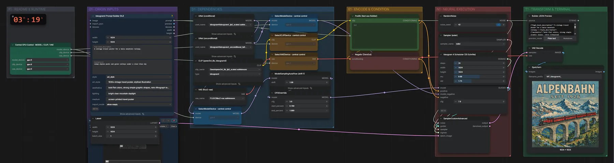
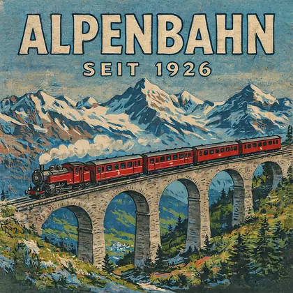

# Ideogram 4 (FP8) · Text → Bild

**Workflow-Datei:** [`workflows/Text to Image/Ideogram4_FP8-Text-to-Image.json`](../../../workflows/Text%20to%20Image/Ideogram4_FP8-Text-to-Image.json)  
**Kategorie:** Text to Image · **Eingabe → Ausgabe:** Text → Bild · **Quant:** FP8

Bis v1.3.0 hieß der Workflow `Ideogram4-Text-to-Image.json`.

Ideogram 4 mit strukturiertem Prompt-Builder (JSON-Felder für Motiv, Text, Stil) und Dual-Model-Guider – stark bei Schrift und Layouts.

Interaktiv mit Zoom, Vergleichen und Kopier-Buttons: <https://dawasteh.github.io/DaWastehs-ComfyUI-Bundle/#/w/ideogram4-fp8-text-to-image>

## Modelle

| Rolle | Datei | Quant | Größe |
|---|---|---|---:|
| Diffusionsmodell | `ideogram4_fp8_scaled.safetensors` | FP8 | 8,6 GiB |
| Diffusionsmodell | `ideogram4_unconditional_fp8_scaled.safetensors` | FP8 | 8,6 GiB |
| Text-Encoder / LLM | `qwen3vl_8b_fp8_scaled.safetensors` | FP8 | 9,9 GiB |
| VAE | `flux2-vae.safetensors` | FP32 | 0,3 GiB |

## Workflow in ComfyUI

Screenshot nach dem Hauptbeispiel (Eingaben und Ergebnis im Workflow, Erklärungstafeln ausgeblendet):

[](workflow.webp)

## Beispiele

### Reiseplakat mit Text-Kästen

Prompt:

```text
A vintage travel poster for a Swiss mountain railway.
```

| Einstellung | Wert |
|---|---|
| background | snowy alpine peaks and green valleys under a clear blue sky |
| style | art_style · 1930s vintage travel poster, stylized illustration |
| Kasten 1 (Text) | ALPENBAHN – großer Titel oben |
| Kasten 2 (Text) | SEIT 1926 – Untertitel |
| Kasten 3 (Objekt) | a red steam locomotive with three carriages crossing a curved stone viaduct, white steam clouds |
| seed | 42 |
| shift | 1.0 |
| sampler_name | euler |
| Dauer (Ausführung) | 1 min 17 s |
| VRAM R9700 (belegt / PyTorch-Spitze) | 28,8 GiB / 25,4 GiB |
| RAM (ComfyUI-Prozess) | 14,0 GiB |

Der Prompt-Builder ist ein Layout-Editor: Jeder Kasten hat eigenen Typ, Text und Beschreibung. Das Beispiel ersetzt die Makro-Auge-Kästen und den Foto-Stil der Vorlage durch Titel-, Untertitel- und Zug-Kasten.

Ausgabe · Speichern: [](poster.webp) · [Volle Auflösung (1024×1024, WebP mit Workflow – per Drag & Drop in ComfyUI ladbar)](poster.webp)  

Builder JSON Preview:

```text
{"high_level_description":"A vintage travel poster for a Swiss mountain railway.","style_description":{"aesthetics":"bold flat colors, strong simple graphic shapes, retro lithograph texture","lighting":"bright clear mountain daylight","medium":"screen-printed travel poster","art_style":"1930s vintage travel poster, stylized illustration"},"compositional_deconstruction":{"background":"snowy alpine peaks and green valleys under a clear blue sky","elements":[{"type":"text","bbox":[40,60,190,940],"text":"ALPENBAHN","desc":"huge bold vintage poster title in cream letters with a dark outline, centered"},{"type":"text","bbox":[200,280,260,720],"text":"SEIT 1926","desc":"small subtitle in the same lettering, centered below the title"},{"type":"obj","bbox":[460,40,860,960],"desc":"a red steam locomotive with three carriages crossing a curved stone viaduct, white steam clouds"}]}}
```
