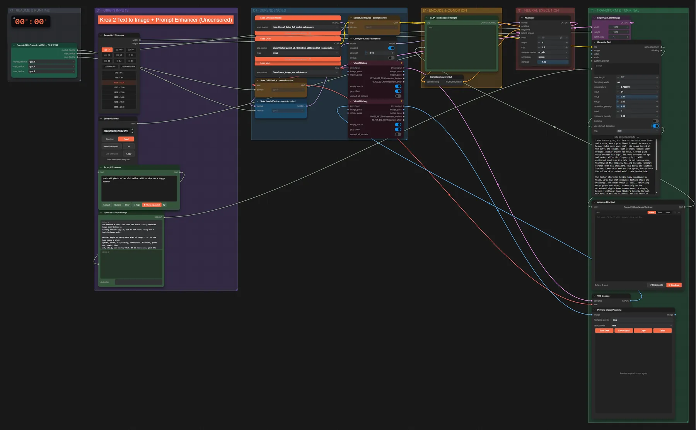
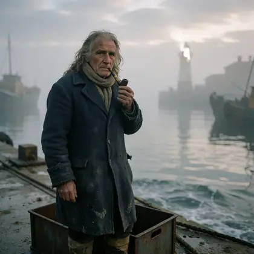

# Krea 2 Turbo + abliterated Qwen3-VL · Idee → Prompt → Bild

**Workflow-Datei:** [`workflows/Text to Image/Krea2_Turbo_FP8+Qwen3VL_4B_Abliterated-Idea-to-Prompt-to-Image.json`](../../../workflows/Text%20to%20Image/Krea2_Turbo_FP8%2BQwen3VL_4B_Abliterated-Idea-to-Prompt-to-Image.json)  
**Kategorie:** Text to Image · **Eingabe → Ausgabe:** Text → Prompt + Bild · **Quant:** FP8

Bis v1.3.0 hieß der Workflow `Krea2_turbo-Uncensored-Prompt-Enhanced-Text-to-Image.json`.

Ein abliterated Qwen3-VL 4B schreibt den Prompt (Pause zum Prüfen), Krea 2 Turbo malt das Bild.

Interaktiv mit Zoom, Vergleichen und Kopier-Buttons: <https://dawasteh.github.io/DaWastehs-ComfyUI-Bundle/#/w/krea2-turbo-fp8-qwen3vl-4b-abliterated-idea-to-prompt-to-image>

## Modelle

| Rolle | Datei | Quant | Größe |
|---|---|---|---:|
| VAE | `qwen_image_vae.safetensors` | BF16 | 0,2 GiB |
| Diffusionsmodell | `krea2_turbo_fp8_scaled.safetensors` | FP8 | 12,2 GiB |
| Text-Encoder / LLM | `Huihui-Qwen3-VL-4B-Instruct-abliterated-fp8_scaled.safetensors` | FP8 | 4,9 GiB |

## Workflow in ComfyUI

Screenshot nach dem Hauptbeispiel (Eingaben und Ergebnis im Workflow, Erklärungstafeln ausgeblendet):

[](workflow.webp)

## Beispiele

### Idee → Prompt (Pause) → Bild

Prompt:

```text
portrait photo of an old sailor with a pipe on a foggy harbor
```

| Einstellung | Wert |
|---|---|
| seed | 35 |
| steps | 8 |
| cfg | 1 |
| sampler_name | er_sde |
| scheduler | simple |
| denoise | 1 |
| Dauer (Ausführung) | 38 s |
| VRAM R9700 (belegt / PyTorch-Spitze) | 21,7 GiB / 21,5 GiB |
| RAM (ComfyUI-Prozess) | 15,0 GiB |

Der Prompt wird am Pause-Knoten unverändert übernommen („Continue“).

Ausgabe · Ausgabe: [](sailor.webp) · [Volle Auflösung (1024×1024, WebP mit Workflow – per Drag & Drop in ComfyUI ladbar)](sailor.webp)  

PixaromaShowText:

```text
**Realistic photograph**

A weathered, elderly sailor stands alone on a fog-laden harbor pier, his face etched with deep lines and a calm, weary gaze fixed forward. He wears a heavy, faded navy wool coat, its seams frayed at the cuffs and collar, with a thick, woolen scarf wrapped loosely around his neck. A brass pipe rests between his lips, its bowl darkened by age and smoke, while his fingers grip it with calloused knuckles. His hair is salt-and-pepper, thinning at the temples, falling in wild, unkempt strands over his shoulders. His boots are scuffed leather, caked with mud and sea spray, tucked into the hollow of a rusted metal crate beside him.

The harbor stretches behind him, swallowed by thick, gray fog that obscures distant ships and buildings. The water below is still, reflecting muted grays and blues, broken only by the occasional ripple from unseen waves. A single, broken lighthouse beam flickers faintly through the mist in the far distance. The sky above is overcast, with soft, diffused light casting no harsh shadows, making everything appear hazy and dreamlike.

The camera focuses sharply on the sailor’s face and hands, while the background dissolves into gentle blur. The image carries a quiet, melancholic atmosphere, tinged with nostalgia and solitude. Every texture—from the rough fabric of his coat to the gritty surface of the dock—is rendered with photographic realism, as if captured by a vintage film camera.
```
