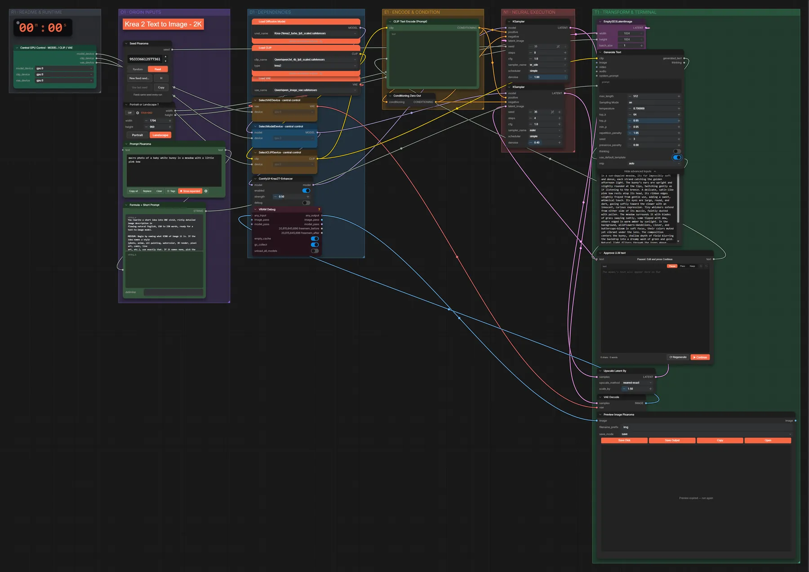
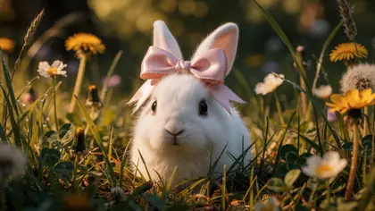

# Krea 2 Turbo · Idee → Prompt → 2K-Bild

**Workflow-Datei:** [`workflows/Text to Image/Krea2_Turbo_FP8-Idea-to-Prompt-to-2K-Image.json`](../../../workflows/Text%20to%20Image/Krea2_Turbo_FP8-Idea-to-Prompt-to-2K-Image.json)  
**Kategorie:** Text to Image · **Eingabe → Ausgabe:** Text → Prompt + Bild · **Quant:** FP8

Bis v1.3.0 hieß der Workflow `Krea2_turbo-2K-Text-to-Image.json`.

Qwen3-VL 4B erweitert die Idee zum Prompt (Pause zum Prüfen), Krea 2 Turbo malt in 8 Schritten und ein zweiter Durchgang vergrößert auf 2K.

Interaktiv mit Zoom, Vergleichen und Kopier-Buttons: <https://dawasteh.github.io/DaWastehs-ComfyUI-Bundle/#/w/krea2-turbo-fp8-idea-to-prompt-to-2k-image>

## Modelle

| Rolle | Datei | Quant | Größe |
|---|---|---|---:|
| VAE | `qwen_image_vae.safetensors` | BF16 | 0,2 GiB |
| Diffusionsmodell | `krea2_turbo_fp8_scaled.safetensors` | FP8 | 12,2 GiB |
| Text-Encoder / LLM | `qwen3vl_4b_fp8_scaled.safetensors` | FP8 | 4,9 GiB |

## Workflow in ComfyUI

Screenshot nach dem Hauptbeispiel (Eingaben und Ergebnis im Workflow, Erklärungstafeln ausgeblendet):

[](workflow.webp)

## Beispiele

### Idee → Prompt (Pause) → 2K-Bild

Prompt:

```text
macro photo of a baby white bunny in a meadow with a little pink bow
```

| Einstellung | Wert |
|---|---|
| seed | 35 |
| cfg | 1 |
| scheduler | simple |
| Dauer (Ausführung) | 1 min 22 s |
| VRAM R9700 (belegt / PyTorch-Spitze) | 30,6 GiB / 25,1 GiB |
| RAM (ComfyUI-Prozess) | 14,8 GiB |

Der Prompt von Qwen3-VL wird am Pause-Knoten unverändert übernommen („Continue“).

Ausgabe · Ausgabe: [](bunny.webp) · [Volle Auflösung (2560×1440, WebP mit Workflow – per Drag & Drop in ComfyUI ladbar)](bunny.webp)  

PixaromaShowText:

```text
**Realistic photograph**

A macro photo captures a tiny white bunny nestled in a sun-dappled meadow, its fur impossibly soft and dense, each strand catching the golden afternoon light. The bunny’s ears are upright and slightly rounded at the tips, twitching gently as if listening to the breeze. A delicate, satin-like pink bow rests atop its head, its ribbon edges slightly frayed from gentle use, adding a sweet, whimsical touch. Its eyes are large, round, and dark, gazing softly toward the viewer with an innocent, curious expression. Tiny whiskers extend from either side of its muzzle, faintly dusted with pollen. The meadow surrounds it with blades of grass swaying subtly, some tipped with dew, others edged in warm amber by sunlight. In the background, wildflowers—dandelions, clover, and buttercups—bloom in soft focus, their colors muted yet vibrant under the lens. The composition centers the bunny, shallow depth of field blurring the backdrop into a dreamy wash of green and gold. Natural light filters through the trees above, casting dappled shadows across the scene. The texture of the fur appears velvety, the grass crisp and alive, the bow gleaming with a subtle sheen. The mood is tranquil, tender, and utterly serene, as if time has paused to admire this quiet, magical moment.
```
