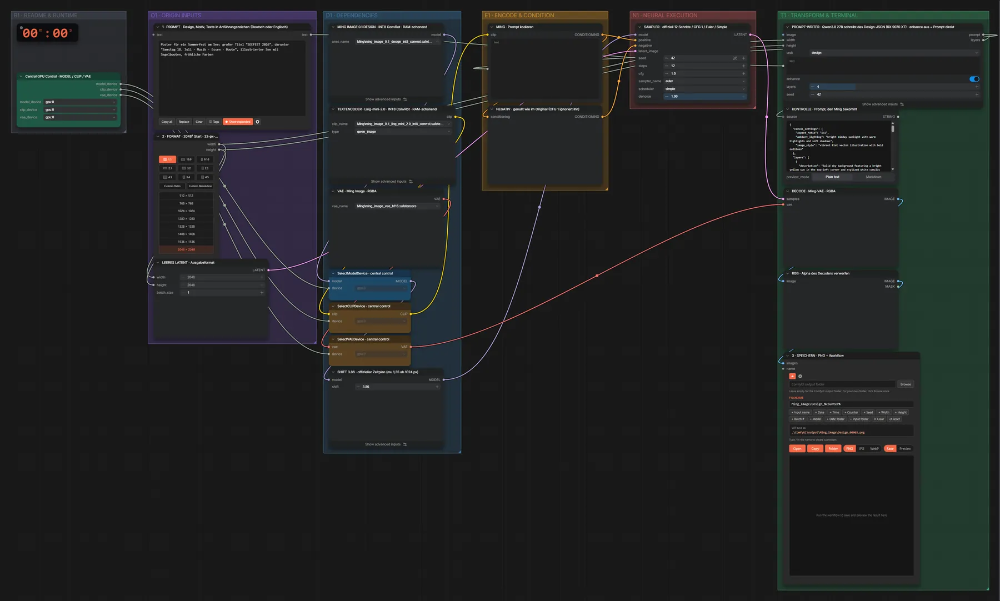
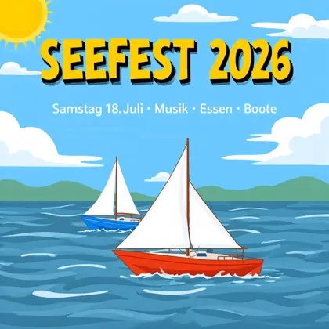

# Ming Image 0.1 Design · Text → Design

**Workflow-Datei:** [`workflows/Text to Image/Ming_Image_0_1_Design_INT8-Text-to-Image.json`](../../../workflows/Text%20to%20Image/Ming_Image_0_1_Design_INT8-Text-to-Image.json)  
**Kategorie:** Text to Image · **Eingabe → Ausgabe:** Text → Bild · **Quant:** INT8

Grafikdesign-Modell (Poster, Karten, Folien) in INT8. Der Qwen3.8-27B-Prompt-Writer schreibt vorher das offizielle Design-JSON; Standardgröße 2048².

Interaktiv mit Zoom, Vergleichen und Kopier-Buttons: <https://dawasteh.github.io/DaWastehs-ComfyUI-Bundle/#/w/ming-image-0-1-design-int8-text-to-image>

## Modelle

| Rolle | Datei | Quant | Größe |
|---|---|---|---:|
| Diffusionsmodell | `ming_image_0.1_design_int8_convrot.safetensors` | INT8 | 5,8 GiB |
| Text-Encoder | `ming_image_0.1_ling_mini_2.0_int8_convrot.safetensors` | INT8 | 18,2 GiB |
| VAE | `ming_image_vae_bf16.safetensors` | BF16 | 0,2 GiB |

## Workflow in ComfyUI

Screenshot nach dem Hauptbeispiel (Eingaben und Ergebnis im Workflow, Erklärungstafeln ausgeblendet):

[](workflow.webp)

## Beispiele

### Design-Idee → Poster (2048²)

Prompt:

```text
Poster für ein Sommerfest am See: großer Titel "SEEFEST 2026", darunter "Samstag 18. Juli · Musik · Essen · Boote", illustrierter See mit Segelbooten, fröhliche Farben
```

| Einstellung | Wert |
|---|---|
| seed | 42 |
| shift | 3.86 |
| steps | 12 |
| cfg | 1.0 |
| sampler_name | euler |
| scheduler | simple |
| denoise | 1.0 |
| Dauer (Ausführung) | 1 min 45 s |
| VRAM R9700 (belegt / PyTorch-Spitze) | 30,7 GiB / 24,9 GiB |
| RAM (ComfyUI-Prozess) | 32,3 GiB |

Ausgabe · 3 · SPEICHERN · PNG + Workflow: [](seefest.webp) · [Volle Auflösung (2048×2048, WebP mit Workflow – per Drag & Drop in ComfyUI ladbar)](seefest.webp)  

KONTROLLE · Prompt, den Ming bekommt:

```text
{
  "canvas_settings": {
    "aspect_ratio": "1:1",
    "ambient_lighting": "bright midday sunlight with warm highlights and soft shadows",
    "image_style": "vibrant flat vector illustration with bold outlines"
  },
  "layers": [
    {
      "description": "Solid sky background featuring a bright yellow sun in the top-left corner and stylized white cumulus clouds scattered across the upper half.",
      "coordinates": "cx: 0.500, cy: 0.250, w: 1.000, h: 0.500",
      "hierarchy_and_relation": "Background layer containing the sun and cloud elements.",
      "color_specs": [
        "#87CEEB",
        "#FFD700",
        "#FFFFFF"
      ]
    },
    {
      "description": "Stylized body of water occupying the lower portion of the canvas, rendered in a gradient of blue tones with white curved wave patterns indicating gentle movement.",
      "coordinates": "cx: 0.500, cy: 0.750, w: 1.000, h: 0.500",
      "hierarchy_and_relation": "Base layer for the lake illustration, positioned below the sky.",
      "color_specs": [
        "#4682B4",
        "#5F9EA0",
        "#FFFFFF"
      ]
    },
    {
      "description": "Illustration of a red-hulled sailboat with white triangular sails moving to the right, accompanied by a smaller blue-hulled sailboat in the background.",
      "coordinates": "cx: 0.500, cy: 0.680, w: 0.700, h: 0.300",
      "hierarchy_and_relation": "Objects floating on the water layer, positioned below the text elements.",
      "color_specs": [
        "#FF4500",
        "#FFFFFF",
        "#1E90FF"
      ]
    },
    {
      "description": "Main title text block centered in the upper third of the canvas, displaying the string \"SEEFEST 2026\" in a bold, playful sans-serif font with a heavy black drop shadow for contrast.",
      "coordinates": "cx: 0.500, cy: 0.180, w: 0.800, h: 0.200",
      "hierarchy_and_relation": "Topmost text layer, stacked above the sky background.",
      "color_specs": [
        "#FFD700",
        "#000000"
      ]
    },
    {
      "description": "Subtitle text block centered directly below the main title, displaying the string \"Samstag 18. Juli · Musik · Essen · Boote\" in a clean, medium-weight sans-serif font.",
      "coordinates": "cx: 0.500, cy: 0.320, w: 0.700, h: 0.080",
      "hierarchy_and_relation": "Secondary text layer, positioned below the main title and above the lake illustration.",
      "color_specs": [
        "#FFFFFF"
      ]
    }
  ]
}
```

### Design-Idee → Poster (1024²)

Prompt:

```text
Poster für ein Sommerfest am See: großer Titel "SEEFEST 2026", darunter "Samstag 18. Juli · Musik · Essen · Boote", illustrierter See mit Segelbooten, fröhliche Farben
```

| Einstellung | Wert |
|---|---|
| width | 1024 |
| height | 1024 |
| seed | 42 |
| shift | 3.86 |
| steps | 12 |
| cfg | 1.0 |
| sampler_name | euler |
| scheduler | simple |
| denoise | 1.0 |
| Dauer (Ausführung) | 0 s |
| VRAM R9700 (belegt / PyTorch-Spitze) | 13,3 GiB / 8,7 GiB |
| RAM (ComfyUI-Prozess) | 28,6 GiB |

Ausgabe · 3 · SPEICHERN · PNG + Workflow: [](seefest-1024.webp)  

KONTROLLE · Prompt, den Ming bekommt:

```text
{
  "canvas_settings": {
    "aspect_ratio": "1:1",
    "ambient_lighting": "bright midday sunlight with warm highlights and soft shadows",
    "image_style": "vibrant flat vector illustration with bold outlines"
  },
  "layers": [
    {
      "description": "Solid sky background featuring a bright yellow sun in the top-left corner and stylized white cumulus clouds scattered across the upper half.",
      "coordinates": "cx: 0.500, cy: 0.250, w: 1.000, h: 0.500",
      "hierarchy_and_relation": "Background layer containing the sun and cloud elements.",
      "color_specs": [
        "#87CEEB",
        "#FFD700",
        "#FFFFFF"
      ]
    },
    {
      "description": "Stylized body of water occupying the lower portion of the canvas, rendered in a gradient of blue tones with white curved wave patterns indicating gentle movement.",
      "coordinates": "cx: 0.500, cy: 0.750, w: 1.000, h: 0.500",
      "hierarchy_and_relation": "Base layer for the lake illustration, positioned below the sky.",
      "color_specs": [
        "#4682B4",
        "#5F9EA0",
        "#FFFFFF"
      ]
    },
    {
      "description": "Illustration of a red-hulled sailboat with white triangular sails moving to the right, accompanied by a smaller blue-hulled sailboat in the background.",
      "coordinates": "cx: 0.500, cy: 0.680, w: 0.700, h: 0.300",
      "hierarchy_and_relation": "Objects floating on the water layer, positioned below the text elements.",
      "color_specs": [
        "#FF4500",
        "#FFFFFF",
        "#1E90FF"
      ]
    },
    {
      "description": "Main title text block centered in the upper third of the canvas, displaying the string \"SEEFEST 2026\" in a bold, playful sans-serif font with a heavy black drop shadow for contrast.",
      "coordinates": "cx: 0.500, cy: 0.180, w: 0.800, h: 0.200",
      "hierarchy_and_relation": "Topmost text layer, stacked above the sky background.",
      "color_specs": [
        "#FFD700",
        "#000000"
      ]
    },
    {
      "description": "Subtitle text block centered directly below the main title, displaying the string \"Samstag 18. Juli · Musik · Essen · Boote\" in a clean, medium-weight sans-serif font.",
      "coordinates": "cx: 0.500, cy: 0.320, w: 0.700, h: 0.080",
      "hierarchy_and_relation": "Secondary text layer, positioned below the main title and above the lake illustration.",
      "color_specs": [
        "#FFFFFF"
      ]
    }
  ]
}
```
