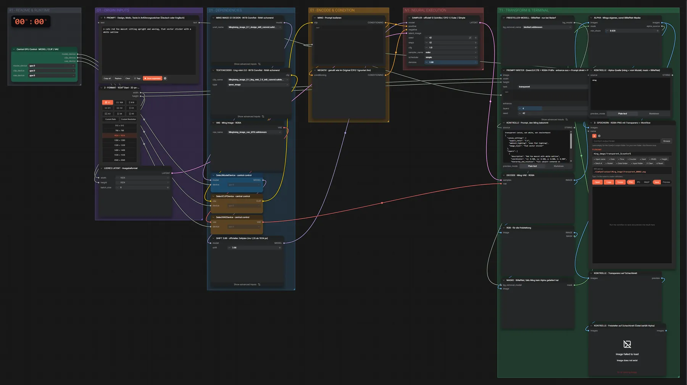

# Ming Image 0.1 Design · Text → transparentes PNG

**Workflow-Datei:** [`workflows/Text to Image/Ming_Image_0_1_Design_INT8-Text-to-Transparent-Image.json`](../../../workflows/Text%20to%20Image/Ming_Image_0_1_Design_INT8-Text-to-Transparent-Image.json)  
**Kategorie:** Text to Image · **Eingabe → Ausgabe:** Text → Bild (RGBA) · **Quant:** INT8

Bis v1.3.0 hieß der Workflow `Ming_Image_0_1_Design_INT8-Transparent-RGBA.json`.

Sticker, Logos und Freisteller mit echtem Alphakanal; liefert das Modell keinen, stellt BiRefNet frei.

Interaktiv mit Zoom, Vergleichen und Kopier-Buttons: <https://dawasteh.github.io/DaWastehs-ComfyUI-Bundle/#/w/ming-image-0-1-design-int8-text-to-transparent-image>

## Modelle

| Rolle | Datei | Quant | Größe |
|---|---|---|---:|
| Diffusionsmodell | `ming_image_0.1_design_int8_convrot.safetensors` | INT8 | 5,8 GiB |
| Text-Encoder | `ming_image_0.1_ling_mini_2.0_int8_convrot.safetensors` | INT8 | 18,2 GiB |
| VAE | `ming_image_vae_bf16.safetensors` | BF16 | 0,2 GiB |
| Freisteller | `birefnet.safetensors` | FP16 | 0,4 GiB |

## Workflow in ComfyUI

Screenshot nach dem Hauptbeispiel (Eingaben und Ergebnis im Workflow, Erklärungstafeln ausgeblendet):

[](workflow.webp)

## Beispiele

### Sticker mit Transparenz

Prompt:

```text
A cute red fox mascot sitting upright and waving, flat vector sticker with a white outline
```

| Einstellung | Wert |
|---|---|
| seed | 42 |
| shift | 3.86 |
| steps | 12 |
| cfg | 1.0 |
| sampler_name | euler |
| scheduler | simple |
| denoise | 1.0 |
| Dauer (Ausführung) | 1 min 3 s |
| VRAM R9700 (belegt / PyTorch-Spitze) | 30,8 GiB / 26,6 GiB |
| VRAM RX 9070 XT (belegt / PyTorch-Spitze) | 0,7 GiB / 0,1 GiB |
| VRAM llama-server (RX 9070 XT) | 11,9 GiB |
| RAM (ComfyUI-Prozess) | 29,3 GiB |

Ausgabe · 3 · SPEICHERN · RGBA-PNG mit Transparenz + Workflow: [](fox-sticker.webp) · [Volle Auflösung (1024×1024, WebP mit Workflow – per Drag & Drop in ComfyUI ladbar)](fox-sticker.webp)  

KONTROLLE · Prompt, den Ming bekommt:

```text
transparent canvas, not white, not checkerboard
{
  "canvas_settings": {
    "aspect_ratio": "1:1",
    "ambient_lighting": "even flat lighting",
    "image_style": "flat vector sticker"
  },
  "layers": [
    {
      "description": "Red fox mascot with white outline",
      "coordinates": "cx: 0.500, cy: 0.500, w: 0.900, h: 0.900",
      "hierarchy_and_relation": "Full subject centered on transparent canvas",
      "color_specs": [
        "#FF6B35",
        "#FFFFFF"
      ]
    }
  ]
}
```

KONTROLLE · Alpha-Quelle (ming = vom Modell, mask = BiRefNet):

```text
ming
```
