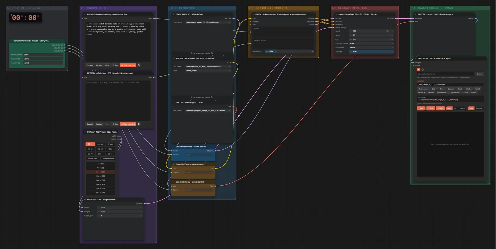
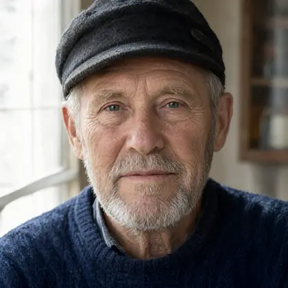
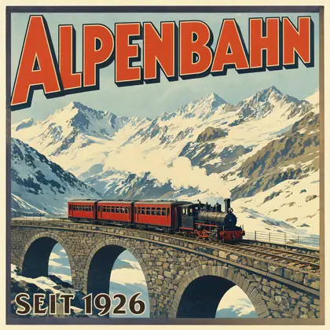

# Qwen Image 2.1 (BF16) · Text → Bild

**Workflow-Datei:** [`workflows/Text to Image/Qwen_Image_2_1_BF16-Text-to-Image.json`](../../../workflows/Text%20to%20Image/Qwen_Image_2_1_BF16-Text-to-Image.json)  
**Kategorie:** Text to Image · **Eingabe → Ausgabe:** Text → Bild · **Quant:** BF16

Alibabas Qwen Image 2.1 in voller Präzision: sehr gute Schrift, lange Prompts, bis 2K. 25 Schritte, CFG 1.

Interaktiv mit Zoom, Vergleichen und Kopier-Buttons: <https://dawasteh.github.io/DaWastehs-ComfyUI-Bundle/#/w/qwen-image-2-1-bf16-text-to-image>

## Modelle

| Rolle | Datei | Quant | Größe |
|---|---|---|---:|
| Diffusionsmodell | `qwen_image_2.1_bf16.safetensors` | BF16 | 13,2 GiB |
| Text-Encoder / LLM | `qwen3vl_8b_int8_convrot.safetensors` | INT8 | 8,7 GiB |
| VAE | `qwen_image_2.1_vae_bf16.safetensors` | BF16 | 0,6 GiB |

## Workflow in ComfyUI

Screenshot nach dem Hauptbeispiel (Eingaben und Ergebnis im Workflow, Erklärungstafeln ausgeblendet):

[](workflow.webp)

## Beispiele

### 3D-Render · Roboter-Barista · 2048 × 2048

Prompt:

```text
A cute small robot barista made of brushed copper and cream enamel with big round glowing eyes, carefully pouring latte art into a cappuccino cup on a wooden café counter, cozy café in the background, 3D render, soft studio lighting, pastel colors
```

| Einstellung | Wert |
|---|---|
| seed | 303 |
| width | 2048 |
| height | 2048 |
| steps | 25 |
| cfg | 1.0 |
| sampler_name | euler |
| scheduler | simple |
| denoise | 1.0 |
| Dauer (Ausführung) | 0 s |
| VRAM R9700 (belegt / PyTorch-Spitze) | 24,5 GiB / 22,7 GiB |
| RAM (ComfyUI-Prozess) | 0,9 GiB |

Ausgabe · SPEICHERN · PNG + Workflow + Alpha: [](robot-2048x2048.webp)  

### 3D-Render · Roboter-Barista · 1536 × 1536

Prompt:

```text
A cute small robot barista made of brushed copper and cream enamel with big round glowing eyes, carefully pouring latte art into a cappuccino cup on a wooden café counter, cozy café in the background, 3D render, soft studio lighting, pastel colors
```

| Einstellung | Wert |
|---|---|
| seed | 303 |
| width | 1536 |
| height | 1536 |
| steps | 25 |
| cfg | 1.0 |
| sampler_name | euler |
| scheduler | simple |
| denoise | 1.0 |
| Dauer (Ausführung) | 20 s |
| VRAM R9700 (belegt / PyTorch-Spitze) | 26,7 GiB / 25,5 GiB |
| RAM (ComfyUI-Prozess) | 2,2 GiB |

Ausgabe · SPEICHERN · PNG + Workflow + Alpha: [](robot-1536x1536.webp)  

### 3D-Render · Roboter-Barista · 1024 × 1024

Prompt:

```text
A cute small robot barista made of brushed copper and cream enamel with big round glowing eyes, carefully pouring latte art into a cappuccino cup on a wooden café counter, cozy café in the background, 3D render, soft studio lighting, pastel colors
```

| Einstellung | Wert |
|---|---|
| seed | 303 |
| width | 1024 |
| height | 1024 |
| steps | 25 |
| cfg | 1.0 |
| sampler_name | euler |
| scheduler | simple |
| denoise | 1.0 |
| Dauer (Ausführung) | 46 s |
| VRAM R9700 (belegt / PyTorch-Spitze) | 26,7 GiB / 25,5 GiB |
| RAM (ComfyUI-Prozess) | 27,6 GiB |

Ausgabe · SPEICHERN · PNG + Workflow + Alpha: [](robot-1024x1024.webp) · [Volle Auflösung (1024×1024, WebP mit Workflow – per Drag & Drop in ComfyUI ladbar)](robot-1024x1024.webp)  

### Porträtfoto · Leuchtturmwärter · 2048 × 2048

Prompt:

```text
Close-up portrait photograph of an elderly lighthouse keeper with a weathered, wrinkled face and a short grey beard, wearing a navy blue knit sweater and a dark wool cap, soft window light from the left, shallow depth of field, 85 mm lens, natural skin texture, calm expression
```

| Einstellung | Wert |
|---|---|
| seed | 101 |
| width | 2048 |
| height | 2048 |
| steps | 25 |
| cfg | 1.0 |
| sampler_name | euler |
| scheduler | simple |
| denoise | 1.0 |
| Dauer (Ausführung) | 0 s |
| VRAM R9700 (belegt / PyTorch-Spitze) | 24,5 GiB / 22,7 GiB |
| RAM (ComfyUI-Prozess) | 0,9 GiB |

Ausgabe · SPEICHERN · PNG + Workflow + Alpha: [](portrait-2048x2048.webp)  

### Porträtfoto · Leuchtturmwärter · 1536 × 1536

Prompt:

```text
Close-up portrait photograph of an elderly lighthouse keeper with a weathered, wrinkled face and a short grey beard, wearing a navy blue knit sweater and a dark wool cap, soft window light from the left, shallow depth of field, 85 mm lens, natural skin texture, calm expression
```

| Einstellung | Wert |
|---|---|
| seed | 101 |
| width | 1536 |
| height | 1536 |
| steps | 25 |
| cfg | 1.0 |
| sampler_name | euler |
| scheduler | simple |
| denoise | 1.0 |
| Dauer (Ausführung) | 20 s |
| VRAM R9700 (belegt / PyTorch-Spitze) | 26,7 GiB / 25,5 GiB |
| RAM (ComfyUI-Prozess) | 2,3 GiB |

Ausgabe · SPEICHERN · PNG + Workflow + Alpha: [](portrait-1536x1536.webp)  

### Porträtfoto · Leuchtturmwärter · 1024 × 1024

Prompt:

```text
Close-up portrait photograph of an elderly lighthouse keeper with a weathered, wrinkled face and a short grey beard, wearing a navy blue knit sweater and a dark wool cap, soft window light from the left, shallow depth of field, 85 mm lens, natural skin texture, calm expression
```

| Einstellung | Wert |
|---|---|
| seed | 101 |
| width | 1024 |
| height | 1024 |
| steps | 25 |
| cfg | 1.0 |
| sampler_name | euler |
| scheduler | simple |
| denoise | 1.0 |
| Dauer (Ausführung) | 20 s |
| VRAM R9700 (belegt / PyTorch-Spitze) | 26,9 GiB / 25,5 GiB |
| RAM (ComfyUI-Prozess) | 2,6 GiB |

Ausgabe · SPEICHERN · PNG + Workflow + Alpha: [](portrait-1024x1024.webp)  

### Fantasy-Gemälde · Stadt über den Wolken · 1024 × 1024

Prompt:

```text
A floating island city high above the clouds at golden hour, white stone towers and arched bridges, waterfalls pouring off the island edges into the clouds, two wooden airships with canvas sails, warm sunlight, highly detailed fantasy digital painting
```

| Einstellung | Wert |
|---|---|
| seed | 202 |
| width | 1024 |
| height | 1024 |
| steps | 25 |
| cfg | 1.0 |
| sampler_name | euler |
| scheduler | simple |
| denoise | 1.0 |
| Dauer (Ausführung) | 20 s |
| VRAM R9700 (belegt / PyTorch-Spitze) | 26,8 GiB / 25,5 GiB |
| RAM (ComfyUI-Prozess) | 1,9 GiB |

Ausgabe · SPEICHERN · PNG + Workflow + Alpha: [](fantasy-1024x1024.webp)  

### Schrift · Reiseplakat „ALPENBAHN“ · 1024 × 1024

Prompt:

```text
Vintage 1920s travel poster for a mountain railway, bold art deco lettering at the top that reads "ALPENBAHN" and smaller text at the bottom that reads "SEIT 1926", a red steam train crossing a stone viaduct, snowy alpine peaks, flat colors, lithograph print texture
```

| Einstellung | Wert |
|---|---|
| seed | 404 |
| width | 1024 |
| height | 1024 |
| steps | 25 |
| cfg | 1.0 |
| sampler_name | euler |
| scheduler | simple |
| denoise | 1.0 |
| Dauer (Ausführung) | 20 s |
| VRAM R9700 (belegt / PyTorch-Spitze) | 26,7 GiB / 25,5 GiB |
| RAM (ComfyUI-Prozess) | 3,4 GiB |

Ausgabe · SPEICHERN · PNG + Workflow + Alpha: [](poster-1024x1024.webp)
