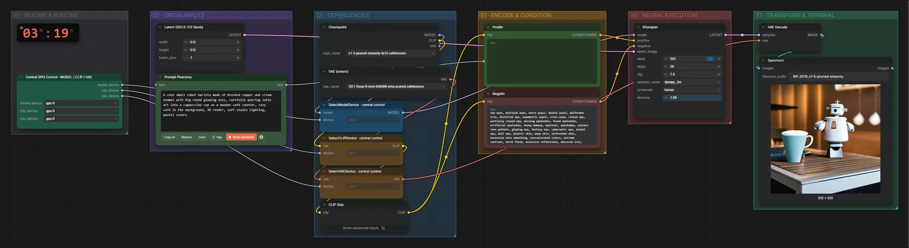
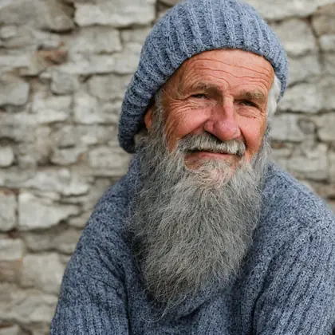
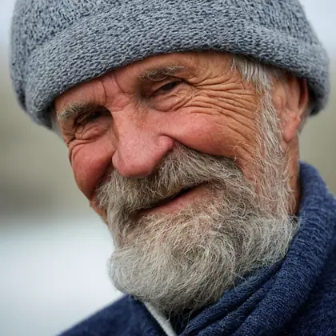
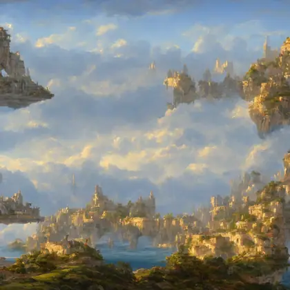
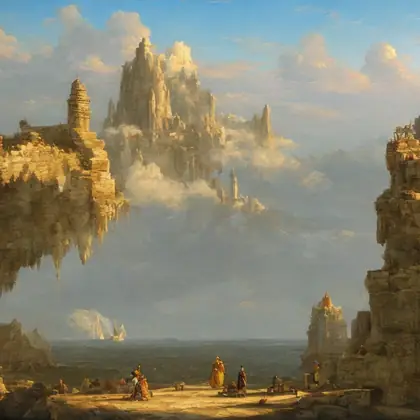
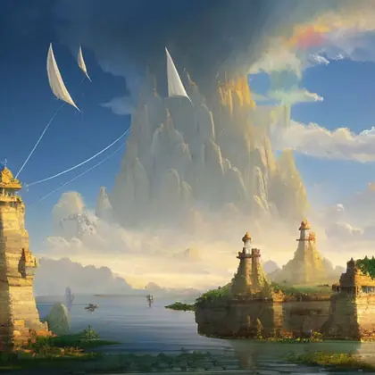
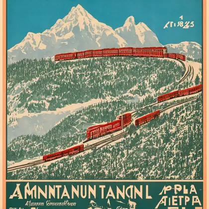
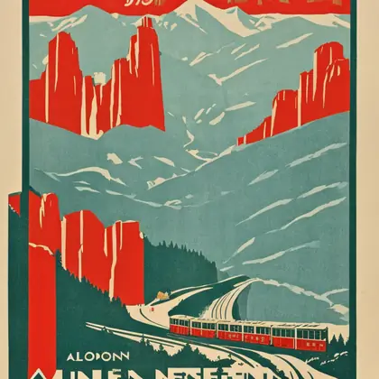
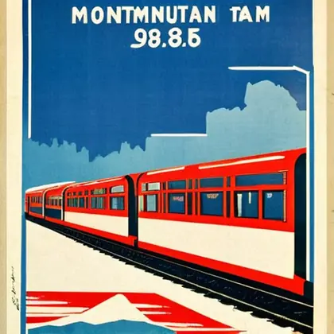

# Stable Diffusion 1.5 · Text → Bild

**Workflow-Datei:** [`workflows/Text to Image/SD15_Base_FP16-Text-to-Image.json`](../../../workflows/Text%20to%20Image/SD15_Base_FP16-Text-to-Image.json)  
**Kategorie:** Text to Image · **Eingabe → Ausgabe:** Text → Bild · **Quant:** FP16

Bis v1.3.0 hieß der Workflow `SD15_v1-5-pruned-emaonly-Text-to-Image.json`.

Das originale SD 1.5 (FP16) als Referenz: 512 px nativ, 28 Schritte. Klein und schnell, aber sichtbar älter.

Interaktiv mit Zoom, Vergleichen und Kopier-Buttons: <https://dawasteh.github.io/DaWastehs-ComfyUI-Bundle/#/w/sd15-base-fp16-text-to-image>

## Modelle

| Rolle | Datei | Quant | Größe |
|---|---|---|---:|
| Modell | `v1-5-pruned-emaonly-fp16.safetensors` | FP16 | 2,0 GiB |
| VAE | `vae-ft-mse-840000-ema-pruned.safetensors` | FP32 | 0,3 GiB |

## Workflow in ComfyUI

Screenshot nach dem Hauptbeispiel (Eingaben und Ergebnis im Workflow, Erklärungstafeln ausgeblendet):

[](workflow.webp)

## Beispiele

### 3D-Render · Roboter-Barista · 1024 × 1024

Prompt:

```text
A cute small robot barista made of brushed copper and cream enamel with big round glowing eyes, carefully pouring latte art into a cappuccino cup on a wooden café counter, cozy café in the background, 3D render, soft studio lighting, pastel colors
```

Negativ:

```text
two eyes, multiple eyes, extra pupil, double pupil, malformed iris, distorted eye, asymmetric pupil, cross-eyed, closed eye, partially closed eye, missing eyelashes, fused eyelashes, artificial eyelashes, heavy makeup, eyeliner, eyeshadow, contact lens pattern, glowing eye, fantasy eye, cybernetic eye, animal eye, doll eye, plastic skin, waxy skin, airbrushed skin, excessive skin smoothing, oversaturated colors, extreme contrast, harsh flash, excessive reflections, obscured iris, blurry iris, out of focus, low detail, low resolution, compression artifacts, noise, illustration, painting, anime, cartoon, 3D render, CGI, text, watermark, logo, frame
```

| Einstellung | Wert |
|---|---|
| seed | 303 |
| width | 1024 |
| height | 1024 |
| steps | 28 |
| cfg | 7 |
| sampler_name | dpmpp_2m |
| scheduler | karras |
| denoise | 1 |
| Dauer (Ausführung) | 7 s |
| VRAM R9700 (belegt / PyTorch-Spitze) | 13,4 GiB / 7,8 GiB |
| RAM (ComfyUI-Prozess) | 1,2 GiB |

Ausgabe · Speichern: [](robot-1024x1024.webp)  

### 3D-Render · Roboter-Barista · 768 × 768

Prompt:

```text
A cute small robot barista made of brushed copper and cream enamel with big round glowing eyes, carefully pouring latte art into a cappuccino cup on a wooden café counter, cozy café in the background, 3D render, soft studio lighting, pastel colors
```

Negativ:

```text
two eyes, multiple eyes, extra pupil, double pupil, malformed iris, distorted eye, asymmetric pupil, cross-eyed, closed eye, partially closed eye, missing eyelashes, fused eyelashes, artificial eyelashes, heavy makeup, eyeliner, eyeshadow, contact lens pattern, glowing eye, fantasy eye, cybernetic eye, animal eye, doll eye, plastic skin, waxy skin, airbrushed skin, excessive skin smoothing, oversaturated colors, extreme contrast, harsh flash, excessive reflections, obscured iris, blurry iris, out of focus, low detail, low resolution, compression artifacts, noise, illustration, painting, anime, cartoon, 3D render, CGI, text, watermark, logo, frame
```

| Einstellung | Wert |
|---|---|
| seed | 303 |
| width | 768 |
| height | 768 |
| steps | 28 |
| cfg | 7 |
| sampler_name | dpmpp_2m |
| scheduler | karras |
| denoise | 1 |
| Dauer (Ausführung) | 3 s |
| VRAM R9700 (belegt / PyTorch-Spitze) | 10,3 GiB / 5,3 GiB |
| RAM (ComfyUI-Prozess) | 1,2 GiB |

Ausgabe · Speichern: [](robot-768x768.webp)  

### 3D-Render · Roboter-Barista · 512 × 512

Prompt:

```text
A cute small robot barista made of brushed copper and cream enamel with big round glowing eyes, carefully pouring latte art into a cappuccino cup on a wooden café counter, cozy café in the background, 3D render, soft studio lighting, pastel colors
```

Negativ:

```text
two eyes, multiple eyes, extra pupil, double pupil, malformed iris, distorted eye, asymmetric pupil, cross-eyed, closed eye, partially closed eye, missing eyelashes, fused eyelashes, artificial eyelashes, heavy makeup, eyeliner, eyeshadow, contact lens pattern, glowing eye, fantasy eye, cybernetic eye, animal eye, doll eye, plastic skin, waxy skin, airbrushed skin, excessive skin smoothing, oversaturated colors, extreme contrast, harsh flash, excessive reflections, obscured iris, blurry iris, out of focus, low detail, low resolution, compression artifacts, noise, illustration, painting, anime, cartoon, 3D render, CGI, text, watermark, logo, frame
```

| Einstellung | Wert |
|---|---|
| seed | 303 |
| width | 512 |
| height | 512 |
| steps | 28 |
| cfg | 7 |
| sampler_name | dpmpp_2m |
| scheduler | karras |
| denoise | 1 |
| Dauer (Ausführung) | 5 s |
| VRAM R9700 (belegt / PyTorch-Spitze) | 6,6 GiB / 3,5 GiB |
| RAM (ComfyUI-Prozess) | 23,6 GiB |

Ausgabe · Speichern: [](robot-512x512.webp) · [Volle Auflösung (512×512, WebP mit Workflow – per Drag & Drop in ComfyUI ladbar)](robot-512x512.webp)  

### Porträtfoto · Leuchtturmwärter · 1024 × 1024

Prompt:

```text
Close-up portrait photograph of an elderly lighthouse keeper with a weathered, wrinkled face and a short grey beard, wearing a navy blue knit sweater and a dark wool cap, soft window light from the left, shallow depth of field, 85 mm lens, natural skin texture, calm expression
```

Negativ:

```text
two eyes, multiple eyes, extra pupil, double pupil, malformed iris, distorted eye, asymmetric pupil, cross-eyed, closed eye, partially closed eye, missing eyelashes, fused eyelashes, artificial eyelashes, heavy makeup, eyeliner, eyeshadow, contact lens pattern, glowing eye, fantasy eye, cybernetic eye, animal eye, doll eye, plastic skin, waxy skin, airbrushed skin, excessive skin smoothing, oversaturated colors, extreme contrast, harsh flash, excessive reflections, obscured iris, blurry iris, out of focus, low detail, low resolution, compression artifacts, noise, illustration, painting, anime, cartoon, 3D render, CGI, text, watermark, logo, frame
```

| Einstellung | Wert |
|---|---|
| seed | 101 |
| width | 1024 |
| height | 1024 |
| steps | 28 |
| cfg | 7 |
| sampler_name | dpmpp_2m |
| scheduler | karras |
| denoise | 1 |
| Dauer (Ausführung) | 7 s |
| VRAM R9700 (belegt / PyTorch-Spitze) | 13,4 GiB / 7,8 GiB |
| RAM (ComfyUI-Prozess) | 1,2 GiB |

Ausgabe · Speichern: [](portrait-1024x1024.webp)  

### Porträtfoto · Leuchtturmwärter · 768 × 768

Prompt:

```text
Close-up portrait photograph of an elderly lighthouse keeper with a weathered, wrinkled face and a short grey beard, wearing a navy blue knit sweater and a dark wool cap, soft window light from the left, shallow depth of field, 85 mm lens, natural skin texture, calm expression
```

Negativ:

```text
two eyes, multiple eyes, extra pupil, double pupil, malformed iris, distorted eye, asymmetric pupil, cross-eyed, closed eye, partially closed eye, missing eyelashes, fused eyelashes, artificial eyelashes, heavy makeup, eyeliner, eyeshadow, contact lens pattern, glowing eye, fantasy eye, cybernetic eye, animal eye, doll eye, plastic skin, waxy skin, airbrushed skin, excessive skin smoothing, oversaturated colors, extreme contrast, harsh flash, excessive reflections, obscured iris, blurry iris, out of focus, low detail, low resolution, compression artifacts, noise, illustration, painting, anime, cartoon, 3D render, CGI, text, watermark, logo, frame
```

| Einstellung | Wert |
|---|---|
| seed | 101 |
| width | 768 |
| height | 768 |
| steps | 28 |
| cfg | 7 |
| sampler_name | dpmpp_2m |
| scheduler | karras |
| denoise | 1 |
| Dauer (Ausführung) | 3 s |
| VRAM R9700 (belegt / PyTorch-Spitze) | 8,4 GiB / 5,3 GiB |
| RAM (ComfyUI-Prozess) | 1,2 GiB |

Ausgabe · Speichern: [](portrait-768x768.webp)  

### Porträtfoto · Leuchtturmwärter · 512 × 512

Prompt:

```text
Close-up portrait photograph of an elderly lighthouse keeper with a weathered, wrinkled face and a short grey beard, wearing a navy blue knit sweater and a dark wool cap, soft window light from the left, shallow depth of field, 85 mm lens, natural skin texture, calm expression
```

Negativ:

```text
two eyes, multiple eyes, extra pupil, double pupil, malformed iris, distorted eye, asymmetric pupil, cross-eyed, closed eye, partially closed eye, missing eyelashes, fused eyelashes, artificial eyelashes, heavy makeup, eyeliner, eyeshadow, contact lens pattern, glowing eye, fantasy eye, cybernetic eye, animal eye, doll eye, plastic skin, waxy skin, airbrushed skin, excessive skin smoothing, oversaturated colors, extreme contrast, harsh flash, excessive reflections, obscured iris, blurry iris, out of focus, low detail, low resolution, compression artifacts, noise, illustration, painting, anime, cartoon, 3D render, CGI, text, watermark, logo, frame
```

| Einstellung | Wert |
|---|---|
| seed | 101 |
| width | 512 |
| height | 512 |
| steps | 28 |
| cfg | 7 |
| sampler_name | dpmpp_2m |
| scheduler | karras |
| denoise | 1 |
| Dauer (Ausführung) | 2 s |
| VRAM R9700 (belegt / PyTorch-Spitze) | 6,8 GiB / 3,5 GiB |
| RAM (ComfyUI-Prozess) | 1,2 GiB |

Ausgabe · Speichern: [](portrait-512x512.webp)  

### Fantasy-Gemälde · Stadt über den Wolken · 1024 × 1024

Prompt:

```text
A floating island city high above the clouds at golden hour, white stone towers and arched bridges, waterfalls pouring off the island edges into the clouds, two wooden airships with canvas sails, warm sunlight, highly detailed fantasy digital painting
```

Negativ:

```text
two eyes, multiple eyes, extra pupil, double pupil, malformed iris, distorted eye, asymmetric pupil, cross-eyed, closed eye, partially closed eye, missing eyelashes, fused eyelashes, artificial eyelashes, heavy makeup, eyeliner, eyeshadow, contact lens pattern, glowing eye, fantasy eye, cybernetic eye, animal eye, doll eye, plastic skin, waxy skin, airbrushed skin, excessive skin smoothing, oversaturated colors, extreme contrast, harsh flash, excessive reflections, obscured iris, blurry iris, out of focus, low detail, low resolution, compression artifacts, noise, illustration, painting, anime, cartoon, 3D render, CGI, text, watermark, logo, frame
```

| Einstellung | Wert |
|---|---|
| seed | 202 |
| width | 1024 |
| height | 1024 |
| steps | 28 |
| cfg | 7 |
| sampler_name | dpmpp_2m |
| scheduler | karras |
| denoise | 1 |
| Dauer (Ausführung) | 7 s |
| VRAM R9700 (belegt / PyTorch-Spitze) | 13,4 GiB / 7,8 GiB |
| RAM (ComfyUI-Prozess) | 1,2 GiB |

Ausgabe · Speichern: [](fantasy-1024x1024.webp)  

### Fantasy-Gemälde · Stadt über den Wolken · 768 × 768

Prompt:

```text
A floating island city high above the clouds at golden hour, white stone towers and arched bridges, waterfalls pouring off the island edges into the clouds, two wooden airships with canvas sails, warm sunlight, highly detailed fantasy digital painting
```

Negativ:

```text
two eyes, multiple eyes, extra pupil, double pupil, malformed iris, distorted eye, asymmetric pupil, cross-eyed, closed eye, partially closed eye, missing eyelashes, fused eyelashes, artificial eyelashes, heavy makeup, eyeliner, eyeshadow, contact lens pattern, glowing eye, fantasy eye, cybernetic eye, animal eye, doll eye, plastic skin, waxy skin, airbrushed skin, excessive skin smoothing, oversaturated colors, extreme contrast, harsh flash, excessive reflections, obscured iris, blurry iris, out of focus, low detail, low resolution, compression artifacts, noise, illustration, painting, anime, cartoon, 3D render, CGI, text, watermark, logo, frame
```

| Einstellung | Wert |
|---|---|
| seed | 202 |
| width | 768 |
| height | 768 |
| steps | 28 |
| cfg | 7 |
| sampler_name | dpmpp_2m |
| scheduler | karras |
| denoise | 1 |
| Dauer (Ausführung) | 3 s |
| VRAM R9700 (belegt / PyTorch-Spitze) | 6,8 GiB / 5,3 GiB |
| RAM (ComfyUI-Prozess) | 1,2 GiB |

Ausgabe · Speichern: [](fantasy-768x768.webp)  

### Fantasy-Gemälde · Stadt über den Wolken · 512 × 512

Prompt:

```text
A floating island city high above the clouds at golden hour, white stone towers and arched bridges, waterfalls pouring off the island edges into the clouds, two wooden airships with canvas sails, warm sunlight, highly detailed fantasy digital painting
```

Negativ:

```text
two eyes, multiple eyes, extra pupil, double pupil, malformed iris, distorted eye, asymmetric pupil, cross-eyed, closed eye, partially closed eye, missing eyelashes, fused eyelashes, artificial eyelashes, heavy makeup, eyeliner, eyeshadow, contact lens pattern, glowing eye, fantasy eye, cybernetic eye, animal eye, doll eye, plastic skin, waxy skin, airbrushed skin, excessive skin smoothing, oversaturated colors, extreme contrast, harsh flash, excessive reflections, obscured iris, blurry iris, out of focus, low detail, low resolution, compression artifacts, noise, illustration, painting, anime, cartoon, 3D render, CGI, text, watermark, logo, frame
```

| Einstellung | Wert |
|---|---|
| seed | 202 |
| width | 512 |
| height | 512 |
| steps | 28 |
| cfg | 7 |
| sampler_name | dpmpp_2m |
| scheduler | karras |
| denoise | 1 |
| Dauer (Ausführung) | 2 s |
| VRAM R9700 (belegt / PyTorch-Spitze) | 6,6 GiB / 3,5 GiB |
| RAM (ComfyUI-Prozess) | 1,2 GiB |

Ausgabe · Speichern: [](fantasy-512x512.webp)  

### Schrift · Reiseplakat „ALPENBAHN“ · 1024 × 1024

Prompt:

```text
Vintage 1920s travel poster for a mountain railway, bold art deco lettering at the top that reads "ALPENBAHN" and smaller text at the bottom that reads "SEIT 1926", a red steam train crossing a stone viaduct, snowy alpine peaks, flat colors, lithograph print texture
```

Negativ:

```text
two eyes, multiple eyes, extra pupil, double pupil, malformed iris, distorted eye, asymmetric pupil, cross-eyed, closed eye, partially closed eye, missing eyelashes, fused eyelashes, artificial eyelashes, heavy makeup, eyeliner, eyeshadow, contact lens pattern, glowing eye, fantasy eye, cybernetic eye, animal eye, doll eye, plastic skin, waxy skin, airbrushed skin, excessive skin smoothing, oversaturated colors, extreme contrast, harsh flash, excessive reflections, obscured iris, blurry iris, out of focus, low detail, low resolution, compression artifacts, noise, illustration, painting, anime, cartoon, 3D render, CGI, text, watermark, logo, frame
```

| Einstellung | Wert |
|---|---|
| seed | 404 |
| width | 1024 |
| height | 1024 |
| steps | 28 |
| cfg | 7 |
| sampler_name | dpmpp_2m |
| scheduler | karras |
| denoise | 1 |
| Dauer (Ausführung) | 7 s |
| VRAM R9700 (belegt / PyTorch-Spitze) | 13,4 GiB / 7,8 GiB |
| RAM (ComfyUI-Prozess) | 1,2 GiB |

Ausgabe · Speichern: [](poster-1024x1024.webp)  

### Schrift · Reiseplakat „ALPENBAHN“ · 768 × 768

Prompt:

```text
Vintage 1920s travel poster for a mountain railway, bold art deco lettering at the top that reads "ALPENBAHN" and smaller text at the bottom that reads "SEIT 1926", a red steam train crossing a stone viaduct, snowy alpine peaks, flat colors, lithograph print texture
```

Negativ:

```text
two eyes, multiple eyes, extra pupil, double pupil, malformed iris, distorted eye, asymmetric pupil, cross-eyed, closed eye, partially closed eye, missing eyelashes, fused eyelashes, artificial eyelashes, heavy makeup, eyeliner, eyeshadow, contact lens pattern, glowing eye, fantasy eye, cybernetic eye, animal eye, doll eye, plastic skin, waxy skin, airbrushed skin, excessive skin smoothing, oversaturated colors, extreme contrast, harsh flash, excessive reflections, obscured iris, blurry iris, out of focus, low detail, low resolution, compression artifacts, noise, illustration, painting, anime, cartoon, 3D render, CGI, text, watermark, logo, frame
```

| Einstellung | Wert |
|---|---|
| seed | 404 |
| width | 768 |
| height | 768 |
| steps | 28 |
| cfg | 7 |
| sampler_name | dpmpp_2m |
| scheduler | karras |
| denoise | 1 |
| Dauer (Ausführung) | 3 s |
| VRAM R9700 (belegt / PyTorch-Spitze) | 6,8 GiB / 5,3 GiB |
| RAM (ComfyUI-Prozess) | 1,2 GiB |

Ausgabe · Speichern: [](poster-768x768.webp)  

### Schrift · Reiseplakat „ALPENBAHN“ · 512 × 512

Prompt:

```text
Vintage 1920s travel poster for a mountain railway, bold art deco lettering at the top that reads "ALPENBAHN" and smaller text at the bottom that reads "SEIT 1926", a red steam train crossing a stone viaduct, snowy alpine peaks, flat colors, lithograph print texture
```

Negativ:

```text
two eyes, multiple eyes, extra pupil, double pupil, malformed iris, distorted eye, asymmetric pupil, cross-eyed, closed eye, partially closed eye, missing eyelashes, fused eyelashes, artificial eyelashes, heavy makeup, eyeliner, eyeshadow, contact lens pattern, glowing eye, fantasy eye, cybernetic eye, animal eye, doll eye, plastic skin, waxy skin, airbrushed skin, excessive skin smoothing, oversaturated colors, extreme contrast, harsh flash, excessive reflections, obscured iris, blurry iris, out of focus, low detail, low resolution, compression artifacts, noise, illustration, painting, anime, cartoon, 3D render, CGI, text, watermark, logo, frame
```

| Einstellung | Wert |
|---|---|
| seed | 404 |
| width | 512 |
| height | 512 |
| steps | 28 |
| cfg | 7 |
| sampler_name | dpmpp_2m |
| scheduler | karras |
| denoise | 1 |
| Dauer (Ausführung) | 2 s |
| VRAM R9700 (belegt / PyTorch-Spitze) | 6,4 GiB / 3,5 GiB |
| RAM (ComfyUI-Prozess) | 1,2 GiB |

Ausgabe · Speichern: [](poster-512x512.webp)
