# SDXL One Obsession v2.0 Bold · Text → Bild

**Workflow-Datei:** [`workflows/Text to Image/SDXL_OneObsession_V20_Bold_FP16-Text-to-Image.json`](../../../workflows/Text%20to%20Image/SDXL_OneObsession_V20_Bold_FP16-Text-to-Image.json)  
**Kategorie:** Text to Image · **Eingabe → Ausgabe:** Text → Bild · **Quant:** FP16

Bis v1.3.0 hieß der Workflow `SDXL_oneObsession_v20Bold-Text-to-Image.json`.

Illustrious-Mix mit kräftigem, plakativem Stil; Tag-Prompts.

Interaktiv mit Zoom, Vergleichen und Kopier-Buttons: <https://dawasteh.github.io/DaWastehs-ComfyUI-Bundle/#/w/sdxl-oneobsession-v20-bold-fp16-text-to-image>

## Modelle

| Rolle | Datei | Quant | Größe |
|---|---|---|---:|
| Modell | `oneObsession_v20Bold.safetensors` | FP16 | 6,5 GiB |
| VAE | `sdxl_vae.safetensors` | FP32 | 0,3 GiB |

## Workflow in ComfyUI

Screenshot nach dem Hauptbeispiel (Eingaben und Ergebnis im Workflow, Erklärungstafeln ausgeblendet):

[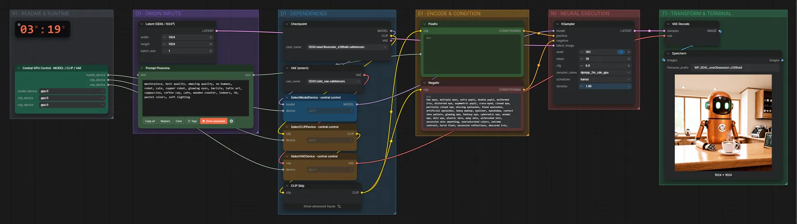](workflow.webp)

## Beispiele

### 3D-Render · Roboter-Barista · 1536 × 1536

Prompt:

```text
masterpiece, best quality, amazing quality, no humans, robot, cute, copper robot, glowing eyes, barista, latte art, cappuccino, coffee cup, cafe, wooden counter, indoors, 3d, pastel colors, soft lighting
```

Negativ:

```text
two eyes, multiple eyes, extra pupil, double pupil, malformed iris, distorted eye, asymmetric pupil, cross-eyed, closed eye, partially closed eye, missing eyelashes, fused eyelashes, artificial eyelashes, heavy makeup, eyeliner, eyeshadow, contact lens pattern, glowing eye, fantasy eye, cybernetic eye, animal eye, doll eye, plastic skin, waxy skin, airbrushed skin, excessive skin smoothing, oversaturated colors, extreme contrast, harsh flash, excessive reflections, obscured iris, blurry iris, out of focus, low detail, low resolution, compression artifacts, noise, illustration, painting, anime, cartoon, 3D render, CGI, text, watermark, logo, frame
```

| Einstellung | Wert |
|---|---|
| seed | 303 |
| width | 1536 |
| height | 1536 |
| steps | 30 |
| cfg | 6 |
| sampler_name | dpmpp_2m_sde_gpu |
| scheduler | karras |
| denoise | 1 |
| Dauer (Ausführung) | 18 s |
| VRAM R9700 (belegt / PyTorch-Spitze) | 26,0 GiB / 13,7 GiB |
| RAM (ComfyUI-Prozess) | 7,1 GiB |

Ausgabe · Speichern: [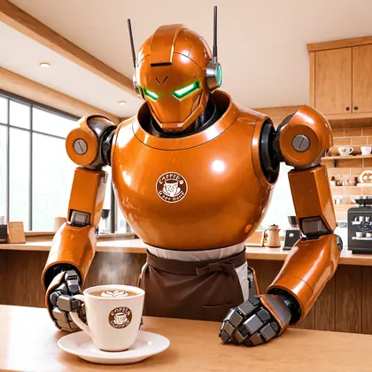](robot-1536x1536.webp)  

### 3D-Render · Roboter-Barista · 1024 × 1024

Prompt:

```text
masterpiece, best quality, amazing quality, no humans, robot, cute, copper robot, glowing eyes, barista, latte art, cappuccino, coffee cup, cafe, wooden counter, indoors, 3d, pastel colors, soft lighting
```

Negativ:

```text
two eyes, multiple eyes, extra pupil, double pupil, malformed iris, distorted eye, asymmetric pupil, cross-eyed, closed eye, partially closed eye, missing eyelashes, fused eyelashes, artificial eyelashes, heavy makeup, eyeliner, eyeshadow, contact lens pattern, glowing eye, fantasy eye, cybernetic eye, animal eye, doll eye, plastic skin, waxy skin, airbrushed skin, excessive skin smoothing, oversaturated colors, extreme contrast, harsh flash, excessive reflections, obscured iris, blurry iris, out of focus, low detail, low resolution, compression artifacts, noise, illustration, painting, anime, cartoon, 3D render, CGI, text, watermark, logo, frame
```

| Einstellung | Wert |
|---|---|
| seed | 303 |
| width | 1024 |
| height | 1024 |
| steps | 30 |
| cfg | 6 |
| sampler_name | dpmpp_2m_sde_gpu |
| scheduler | karras |
| denoise | 1 |
| Dauer (Ausführung) | 16 s |
| VRAM R9700 (belegt / PyTorch-Spitze) | 11,5 GiB / 12,4 GiB |
| RAM (ComfyUI-Prozess) | 12,4 GiB |

Ausgabe · Speichern: [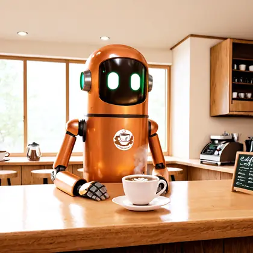](robot-1024x1024.webp) · [Volle Auflösung (1024×1024, WebP mit Workflow – per Drag & Drop in ComfyUI ladbar)](robot-1024x1024.webp)  

### 3D-Render · Roboter-Barista · 768 × 768

Prompt:

```text
masterpiece, best quality, amazing quality, no humans, robot, cute, copper robot, glowing eyes, barista, latte art, cappuccino, coffee cup, cafe, wooden counter, indoors, 3d, pastel colors, soft lighting
```

Negativ:

```text
two eyes, multiple eyes, extra pupil, double pupil, malformed iris, distorted eye, asymmetric pupil, cross-eyed, closed eye, partially closed eye, missing eyelashes, fused eyelashes, artificial eyelashes, heavy makeup, eyeliner, eyeshadow, contact lens pattern, glowing eye, fantasy eye, cybernetic eye, animal eye, doll eye, plastic skin, waxy skin, airbrushed skin, excessive skin smoothing, oversaturated colors, extreme contrast, harsh flash, excessive reflections, obscured iris, blurry iris, out of focus, low detail, low resolution, compression artifacts, noise, illustration, painting, anime, cartoon, 3D render, CGI, text, watermark, logo, frame
```

| Einstellung | Wert |
|---|---|
| seed | 303 |
| width | 768 |
| height | 768 |
| steps | 30 |
| cfg | 6 |
| sampler_name | dpmpp_2m_sde_gpu |
| scheduler | karras |
| denoise | 1 |
| Dauer (Ausführung) | 4 s |
| VRAM R9700 (belegt / PyTorch-Spitze) | 11,9 GiB / 9,9 GiB |
| RAM (ComfyUI-Prozess) | 1,2 GiB |

Ausgabe · Speichern: [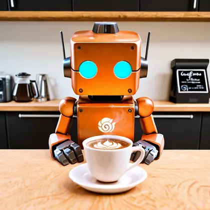](robot-768x768.webp)  

### Porträtfoto · Leuchtturmwärter · 1536 × 1536

Prompt:

```text
masterpiece, best quality, amazing quality, 1boy, solo, old man, grey beard, wrinkled skin, lighthouse keeper, navy blue sweater, knit cap, portrait, upper body, window light, looking to the side, calm, realistic
```

Negativ:

```text
two eyes, multiple eyes, extra pupil, double pupil, malformed iris, distorted eye, asymmetric pupil, cross-eyed, closed eye, partially closed eye, missing eyelashes, fused eyelashes, artificial eyelashes, heavy makeup, eyeliner, eyeshadow, contact lens pattern, glowing eye, fantasy eye, cybernetic eye, animal eye, doll eye, plastic skin, waxy skin, airbrushed skin, excessive skin smoothing, oversaturated colors, extreme contrast, harsh flash, excessive reflections, obscured iris, blurry iris, out of focus, low detail, low resolution, compression artifacts, noise, illustration, painting, anime, cartoon, 3D render, CGI, text, watermark, logo, frame
```

| Einstellung | Wert |
|---|---|
| seed | 101 |
| width | 1536 |
| height | 1536 |
| steps | 30 |
| cfg | 6 |
| sampler_name | dpmpp_2m_sde_gpu |
| scheduler | karras |
| denoise | 1 |
| Dauer (Ausführung) | 18 s |
| VRAM R9700 (belegt / PyTorch-Spitze) | 26,2 GiB / 13,9 GiB |
| RAM (ComfyUI-Prozess) | 6,9 GiB |

Ausgabe · Speichern: [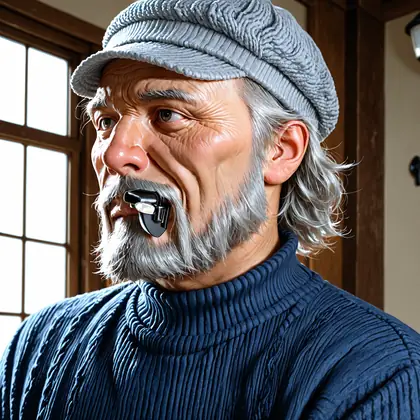](portrait-1536x1536.webp)  

### Porträtfoto · Leuchtturmwärter · 1024 × 1024

Prompt:

```text
masterpiece, best quality, amazing quality, 1boy, solo, old man, grey beard, wrinkled skin, lighthouse keeper, navy blue sweater, knit cap, portrait, upper body, window light, looking to the side, calm, realistic
```

Negativ:

```text
two eyes, multiple eyes, extra pupil, double pupil, malformed iris, distorted eye, asymmetric pupil, cross-eyed, closed eye, partially closed eye, missing eyelashes, fused eyelashes, artificial eyelashes, heavy makeup, eyeliner, eyeshadow, contact lens pattern, glowing eye, fantasy eye, cybernetic eye, animal eye, doll eye, plastic skin, waxy skin, airbrushed skin, excessive skin smoothing, oversaturated colors, extreme contrast, harsh flash, excessive reflections, obscured iris, blurry iris, out of focus, low detail, low resolution, compression artifacts, noise, illustration, painting, anime, cartoon, 3D render, CGI, text, watermark, logo, frame
```

| Einstellung | Wert |
|---|---|
| seed | 101 |
| width | 1024 |
| height | 1024 |
| steps | 30 |
| cfg | 6 |
| sampler_name | dpmpp_2m_sde_gpu |
| scheduler | karras |
| denoise | 1 |
| Dauer (Ausführung) | 8 s |
| VRAM R9700 (belegt / PyTorch-Spitze) | 17,6 GiB / 12,4 GiB |
| RAM (ComfyUI-Prozess) | 1,2 GiB |

Ausgabe · Speichern: [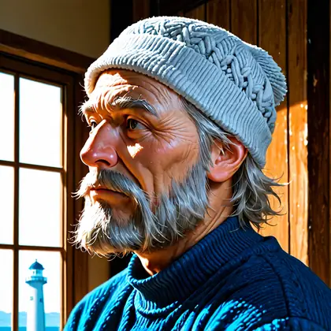](portrait-1024x1024.webp)  

### Porträtfoto · Leuchtturmwärter · 768 × 768

Prompt:

```text
masterpiece, best quality, amazing quality, 1boy, solo, old man, grey beard, wrinkled skin, lighthouse keeper, navy blue sweater, knit cap, portrait, upper body, window light, looking to the side, calm, realistic
```

Negativ:

```text
two eyes, multiple eyes, extra pupil, double pupil, malformed iris, distorted eye, asymmetric pupil, cross-eyed, closed eye, partially closed eye, missing eyelashes, fused eyelashes, artificial eyelashes, heavy makeup, eyeliner, eyeshadow, contact lens pattern, glowing eye, fantasy eye, cybernetic eye, animal eye, doll eye, plastic skin, waxy skin, airbrushed skin, excessive skin smoothing, oversaturated colors, extreme contrast, harsh flash, excessive reflections, obscured iris, blurry iris, out of focus, low detail, low resolution, compression artifacts, noise, illustration, painting, anime, cartoon, 3D render, CGI, text, watermark, logo, frame
```

| Einstellung | Wert |
|---|---|
| seed | 101 |
| width | 768 |
| height | 768 |
| steps | 30 |
| cfg | 6 |
| sampler_name | dpmpp_2m_sde_gpu |
| scheduler | karras |
| denoise | 1 |
| Dauer (Ausführung) | 6 s |
| VRAM R9700 (belegt / PyTorch-Spitze) | 11,4 GiB / 9,9 GiB |
| RAM (ComfyUI-Prozess) | 7,1 GiB |

Ausgabe · Speichern: [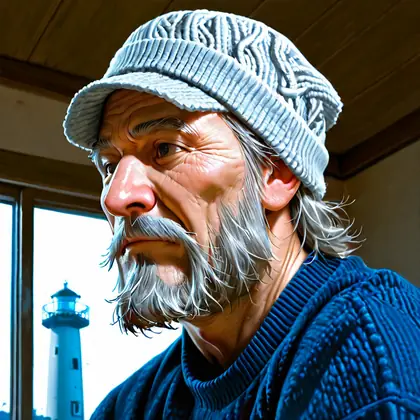](portrait-768x768.webp)  

### Fantasy-Gemälde · Stadt über den Wolken · 1536 × 1536

Prompt:

```text
masterpiece, best quality, amazing quality, scenery, no humans, floating island, sky city, white towers, stone bridge, waterfall, clouds, airship, golden hour, sunset, fantasy, detailed background
```

Negativ:

```text
two eyes, multiple eyes, extra pupil, double pupil, malformed iris, distorted eye, asymmetric pupil, cross-eyed, closed eye, partially closed eye, missing eyelashes, fused eyelashes, artificial eyelashes, heavy makeup, eyeliner, eyeshadow, contact lens pattern, glowing eye, fantasy eye, cybernetic eye, animal eye, doll eye, plastic skin, waxy skin, airbrushed skin, excessive skin smoothing, oversaturated colors, extreme contrast, harsh flash, excessive reflections, obscured iris, blurry iris, out of focus, low detail, low resolution, compression artifacts, noise, illustration, painting, anime, cartoon, 3D render, CGI, text, watermark, logo, frame
```

| Einstellung | Wert |
|---|---|
| seed | 202 |
| width | 1536 |
| height | 1536 |
| steps | 30 |
| cfg | 6 |
| sampler_name | dpmpp_2m_sde_gpu |
| scheduler | karras |
| denoise | 1 |
| Dauer (Ausführung) | 18 s |
| VRAM R9700 (belegt / PyTorch-Spitze) | 26,2 GiB / 13,9 GiB |
| RAM (ComfyUI-Prozess) | 6,9 GiB |

Ausgabe · Speichern: [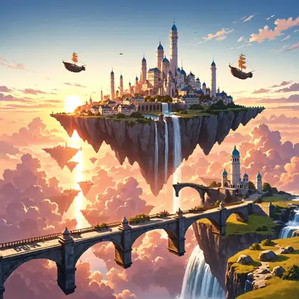](fantasy-1536x1536.webp)  

### Fantasy-Gemälde · Stadt über den Wolken · 1024 × 1024

Prompt:

```text
masterpiece, best quality, amazing quality, scenery, no humans, floating island, sky city, white towers, stone bridge, waterfall, clouds, airship, golden hour, sunset, fantasy, detailed background
```

Negativ:

```text
two eyes, multiple eyes, extra pupil, double pupil, malformed iris, distorted eye, asymmetric pupil, cross-eyed, closed eye, partially closed eye, missing eyelashes, fused eyelashes, artificial eyelashes, heavy makeup, eyeliner, eyeshadow, contact lens pattern, glowing eye, fantasy eye, cybernetic eye, animal eye, doll eye, plastic skin, waxy skin, airbrushed skin, excessive skin smoothing, oversaturated colors, extreme contrast, harsh flash, excessive reflections, obscured iris, blurry iris, out of focus, low detail, low resolution, compression artifacts, noise, illustration, painting, anime, cartoon, 3D render, CGI, text, watermark, logo, frame
```

| Einstellung | Wert |
|---|---|
| seed | 202 |
| width | 1024 |
| height | 1024 |
| steps | 30 |
| cfg | 6 |
| sampler_name | dpmpp_2m_sde_gpu |
| scheduler | karras |
| denoise | 1 |
| Dauer (Ausführung) | 8 s |
| VRAM R9700 (belegt / PyTorch-Spitze) | 17,6 GiB / 12,4 GiB |
| RAM (ComfyUI-Prozess) | 1,2 GiB |

Ausgabe · Speichern: [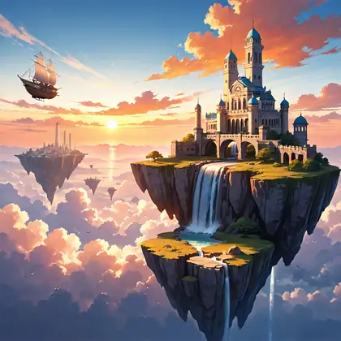](fantasy-1024x1024.webp)  

### Fantasy-Gemälde · Stadt über den Wolken · 768 × 768

Prompt:

```text
masterpiece, best quality, amazing quality, scenery, no humans, floating island, sky city, white towers, stone bridge, waterfall, clouds, airship, golden hour, sunset, fantasy, detailed background
```

Negativ:

```text
two eyes, multiple eyes, extra pupil, double pupil, malformed iris, distorted eye, asymmetric pupil, cross-eyed, closed eye, partially closed eye, missing eyelashes, fused eyelashes, artificial eyelashes, heavy makeup, eyeliner, eyeshadow, contact lens pattern, glowing eye, fantasy eye, cybernetic eye, animal eye, doll eye, plastic skin, waxy skin, airbrushed skin, excessive skin smoothing, oversaturated colors, extreme contrast, harsh flash, excessive reflections, obscured iris, blurry iris, out of focus, low detail, low resolution, compression artifacts, noise, illustration, painting, anime, cartoon, 3D render, CGI, text, watermark, logo, frame
```

| Einstellung | Wert |
|---|---|
| seed | 202 |
| width | 768 |
| height | 768 |
| steps | 30 |
| cfg | 6 |
| sampler_name | dpmpp_2m_sde_gpu |
| scheduler | karras |
| denoise | 1 |
| Dauer (Ausführung) | 6 s |
| VRAM R9700 (belegt / PyTorch-Spitze) | 11,4 GiB / 9,9 GiB |
| RAM (ComfyUI-Prozess) | 6,8 GiB |

Ausgabe · Speichern: [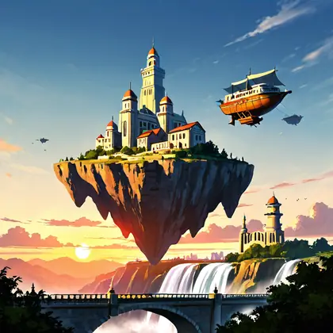](fantasy-768x768.webp)  

### Schrift · Reiseplakat „ALPENBAHN“ · 1536 × 1536

Prompt:

```text
masterpiece, best quality, amazing quality, poster, vintage, art deco, text "ALPENBAHN", red train, steam locomotive, viaduct, snowy mountains, alps, flat color, lithograph, no humans
```

Negativ:

```text
two eyes, multiple eyes, extra pupil, double pupil, malformed iris, distorted eye, asymmetric pupil, cross-eyed, closed eye, partially closed eye, missing eyelashes, fused eyelashes, artificial eyelashes, heavy makeup, eyeliner, eyeshadow, contact lens pattern, glowing eye, fantasy eye, cybernetic eye, animal eye, doll eye, plastic skin, waxy skin, airbrushed skin, excessive skin smoothing, oversaturated colors, extreme contrast, harsh flash, excessive reflections, obscured iris, blurry iris, out of focus, low detail, low resolution, compression artifacts, noise, illustration, painting, anime, cartoon, 3D render, CGI, text, watermark, logo, frame
```

| Einstellung | Wert |
|---|---|
| seed | 404 |
| width | 1536 |
| height | 1536 |
| steps | 30 |
| cfg | 6 |
| sampler_name | dpmpp_2m_sde_gpu |
| scheduler | karras |
| denoise | 1 |
| Dauer (Ausführung) | 18 s |
| VRAM R9700 (belegt / PyTorch-Spitze) | 26,2 GiB / 13,9 GiB |
| RAM (ComfyUI-Prozess) | 6,9 GiB |

Ausgabe · Speichern: [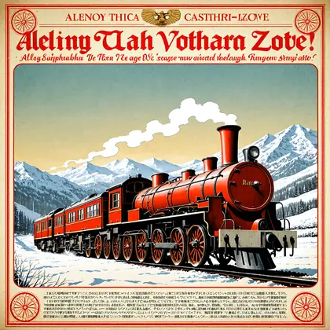](poster-1536x1536.webp)  

### Schrift · Reiseplakat „ALPENBAHN“ · 1024 × 1024

Prompt:

```text
masterpiece, best quality, amazing quality, poster, vintage, art deco, text "ALPENBAHN", red train, steam locomotive, viaduct, snowy mountains, alps, flat color, lithograph, no humans
```

Negativ:

```text
two eyes, multiple eyes, extra pupil, double pupil, malformed iris, distorted eye, asymmetric pupil, cross-eyed, closed eye, partially closed eye, missing eyelashes, fused eyelashes, artificial eyelashes, heavy makeup, eyeliner, eyeshadow, contact lens pattern, glowing eye, fantasy eye, cybernetic eye, animal eye, doll eye, plastic skin, waxy skin, airbrushed skin, excessive skin smoothing, oversaturated colors, extreme contrast, harsh flash, excessive reflections, obscured iris, blurry iris, out of focus, low detail, low resolution, compression artifacts, noise, illustration, painting, anime, cartoon, 3D render, CGI, text, watermark, logo, frame
```

| Einstellung | Wert |
|---|---|
| seed | 404 |
| width | 1024 |
| height | 1024 |
| steps | 30 |
| cfg | 6 |
| sampler_name | dpmpp_2m_sde_gpu |
| scheduler | karras |
| denoise | 1 |
| Dauer (Ausführung) | 8 s |
| VRAM R9700 (belegt / PyTorch-Spitze) | 17,6 GiB / 12,4 GiB |
| RAM (ComfyUI-Prozess) | 1,2 GiB |

Ausgabe · Speichern: [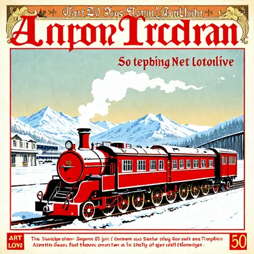](poster-1024x1024.webp)  

### Schrift · Reiseplakat „ALPENBAHN“ · 768 × 768

Prompt:

```text
masterpiece, best quality, amazing quality, poster, vintage, art deco, text "ALPENBAHN", red train, steam locomotive, viaduct, snowy mountains, alps, flat color, lithograph, no humans
```

Negativ:

```text
two eyes, multiple eyes, extra pupil, double pupil, malformed iris, distorted eye, asymmetric pupil, cross-eyed, closed eye, partially closed eye, missing eyelashes, fused eyelashes, artificial eyelashes, heavy makeup, eyeliner, eyeshadow, contact lens pattern, glowing eye, fantasy eye, cybernetic eye, animal eye, doll eye, plastic skin, waxy skin, airbrushed skin, excessive skin smoothing, oversaturated colors, extreme contrast, harsh flash, excessive reflections, obscured iris, blurry iris, out of focus, low detail, low resolution, compression artifacts, noise, illustration, painting, anime, cartoon, 3D render, CGI, text, watermark, logo, frame
```

| Einstellung | Wert |
|---|---|
| seed | 404 |
| width | 768 |
| height | 768 |
| steps | 30 |
| cfg | 6 |
| sampler_name | dpmpp_2m_sde_gpu |
| scheduler | karras |
| denoise | 1 |
| Dauer (Ausführung) | 6 s |
| VRAM R9700 (belegt / PyTorch-Spitze) | 11,4 GiB / 9,9 GiB |
| RAM (ComfyUI-Prozess) | 6,8 GiB |

Ausgabe · Speichern: [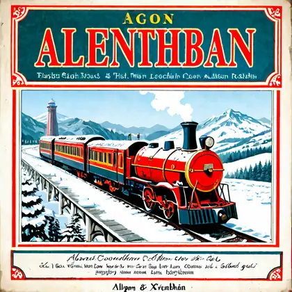](poster-768x768.webp)
