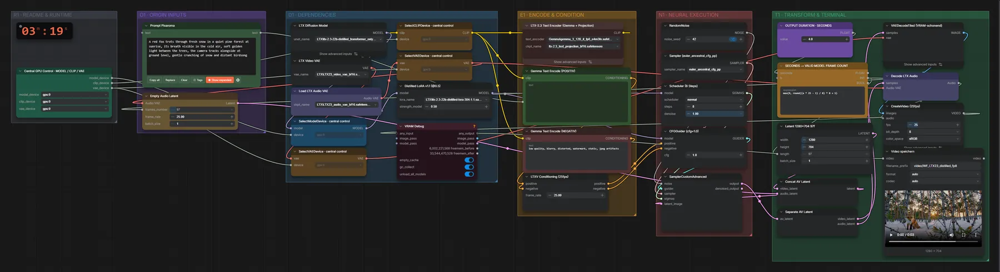

# LTX-2.3 22B distilled (FP8) · Text → Video mit Ton

**Workflow-Datei:** [`workflows/Text to Video/LTX23_22B_Distilled_FP8-Text-to-Video.json`](../../../workflows/Text%20to%20Video/LTX23_22B_Distilled_FP8-Text-to-Video.json)  
**Kategorie:** Text to Video · **Eingabe → Ausgabe:** Text → Video + Audio · **Quant:** FP8

Bis v1.3.0 hieß der Workflow `LTX23_distilled_fp8-Text-to-Video.json`.

LTX-2.3 erzeugt Bild und Ton gemeinsam (Gemma-3-12B-Text-Encoder). 8 Schritte, CFG 1, 1280×704, Länge über „Output Duration“.

Interaktiv mit Zoom, Vergleichen und Kopier-Buttons: <https://dawasteh.github.io/DaWastehs-ComfyUI-Bundle/#/w/ltx23-22b-distilled-fp8-text-to-video>

## Modelle

| Rolle | Datei | Quant | Größe |
|---|---|---|---:|
| Diffusionsmodell | `ltx-2.3-22b-distilled_transformer_only_fp8_input_scaled_v3.safetensors` | FP8 | 23,3 GiB |
| LoRA | `ltx-2.3-22b-distilled-lora-384-1.1.safetensors` | BF16 | 7,1 GiB |
| VAE | `LTX23_video_vae_bf16.safetensors` | BF16 | 1,4 GiB |
| Text-Encoder | `gemma_3_12B_it_fp8_e4m3fn.safetensors` | FP8 | 12,3 GiB |
| Text-Encoder | `ltx-2.3_text_projection_bf16.safetensors` | BF16 | 2,1 GiB |
| Audio-VAE | `LTX23_audio_vae_bf16.safetensors` | BF16 | 0,3 GiB |

## Workflow in ComfyUI

Screenshot nach dem Hauptbeispiel (Eingaben und Ergebnis im Workflow, Erklärungstafeln ausgeblendet):

[](workflow.webp)

## Beispiele

### Fuchs im Schnee

Prompt:

```text
A red fox trots through fresh snow in a quiet pine forest at sunrise, its breath visible in the cold air, soft golden light between the trees, the camera tracks alongside at ground level, gentle crunching of snow and distant birdsong
```

Negativ:

```text
low quality, blurry, distorted, watermark, static, jpeg artifacts
```

| Einstellung | Wert |
|---|---|
| duration | 4 s |
| seed | 42 |
| sampler_name | euler_ancestral_cfg_pp |
| scheduler | normal |
| steps | 8 |
| denoise | 1 |
| cfg | 1 |
| Dauer (Ausführung) | 6 min 7 s |
| VRAM R9700 (belegt / PyTorch-Spitze) | 30,7 GiB / 27,2 GiB |
| RAM (ComfyUI-Prozess) | 35,8 GiB |

Ausgabe · Video speichern: [fox.mp4](fox.mp4)  

### Barista · Latte Art

Prompt:

```text
Close-up of a barista pouring steamed milk into a cappuccino and forming a heart-shaped latte art, soft morning light, shallow depth of field, quiet café ambience with clinking cups
```

Negativ:

```text
low quality, blurry, distorted, watermark, static, jpeg artifacts
```

| Einstellung | Wert |
|---|---|
| duration | 4 s |
| seed | 42 |
| sampler_name | euler_ancestral_cfg_pp |
| scheduler | normal |
| steps | 8 |
| denoise | 1 |
| cfg | 1 |
| Dauer (Ausführung) | 8 min 5 s |
| VRAM R9700 (belegt / PyTorch-Spitze) | 30,8 GiB / 27,2 GiB |
| RAM (ComfyUI-Prozess) | 35,1 GiB |

Ausgabe · Video speichern: [barista.mp4](barista.mp4)
