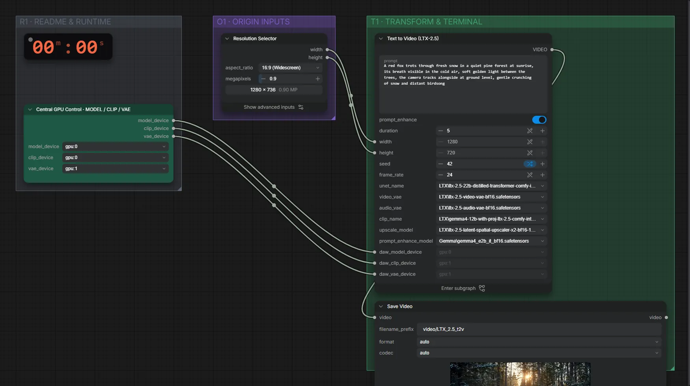

# LTX-2.5 22B (INT8) · Text → Video mit Ton

**Workflow-Datei:** [`workflows/Text to Video/LTX25_22B_INT8-Text-to-Video.json`](../../../workflows/Text%20to%20Video/LTX25_22B_INT8-Text-to-Video.json)  
**Kategorie:** Text to Video · **Eingabe → Ausgabe:** Text → Video + Audio · **Quant:** INT8

Bis v1.3.0 hieß der Workflow `LTX25_INT8_ConvRot-Text-to-Video.json`.

LTX-2.5 destilliert in INT8 mit optionalem Gemma-Prompt-Enhancer und latentem 2×-Upscaler; 1280×720, 24 fps.

Interaktiv mit Zoom, Vergleichen und Kopier-Buttons: <https://dawasteh.github.io/DaWastehs-ComfyUI-Bundle/#/w/ltx25-22b-int8-text-to-video>

## Modelle

| Rolle | Datei | Quant | Größe |
|---|---|---|---:|
| Modell | `ltx-2.5-22b-distilled-transformer-comfy-int8-convrot.safetensors` | INT8 | 20,0 GiB |
| Modell | `ltx-2.5-video-vae-bf16.safetensors` | BF16 | 1,4 GiB |
| Modell | `ltx-2.5-audio-vae-bf16.safetensors` | BF16 | 0,3 GiB |
| Modell | `gemma4-12b-with-proj-ltx-2.5-comfy-int8-convrot.safetensors` | INT8 | 14,3 GiB |
| Modell | `ltx-2.5-latent-spatial-upscaler-x2-bf16-1.0.safetensors` | BF16 | 0,9 GiB |
| Modell | `gemma4_e2b_it_bf16.safetensors` | BF16 | 9,6 GiB |

## Workflow in ComfyUI

Screenshot nach dem Hauptbeispiel (Eingaben und Ergebnis im Workflow, Erklärungstafeln ausgeblendet):

[](workflow.webp)

## Beispiele

### Fuchs im Schnee (mit Prompt-Enhancer)

Prompt:

```text
A red fox trots through fresh snow in a quiet pine forest at sunrise, its breath visible in the cold air, soft golden light between the trees, the camera tracks alongside at ground level, gentle crunching of snow and distant birdsong
```

| Einstellung | Wert |
|---|---|
| duration | 5 s |
| seed | 42 |
| Dauer (Ausführung) | 2 min 59 s |
| VRAM R9700 (belegt / PyTorch-Spitze) | 27,4 GiB / 24,1 GiB |
| VRAM RX 9070 XT (belegt / PyTorch-Spitze) | 9,4 GiB / 5,1 GiB |
| RAM (ComfyUI-Prozess) | 32,1 GiB |

Gemma verbessert den Prompt vor dem Rendern (Standard im Workflow, „Enable Prompt Enhance“).

Ausgabe · Ausgabe: [fox.mp4](fox.mp4)  

PreviewAny:

```text
An extreme wide shot captures a vibrant red fox trotting purposefully through a dense, quiet pine forest blanketed in fresh, undisturbed snow at sunrise, illuminated by soft golden light filtering intensely between the tall, dark green pine trees; the camera tracks alongside the fox at ground level, maintaining a low-angle perspective that emphasizes the deep texture of the snow underfoot, while the fox's warm breath plumes visibly in the frigid, misty air, accompanied by the distinct, gentle crunching sound of snow with each paw placement and the faint, distant melody of birdsong filling the cool atmosphere; the scene is rendered with beautiful natural lighting, rich, saturated film-grade color emphasizing the contrast between the fiery red fur and the pristine white snow, crisp high-resolution detail on the pine needles and frost, creating a serene and tranquil cinematic visual experience.
```
