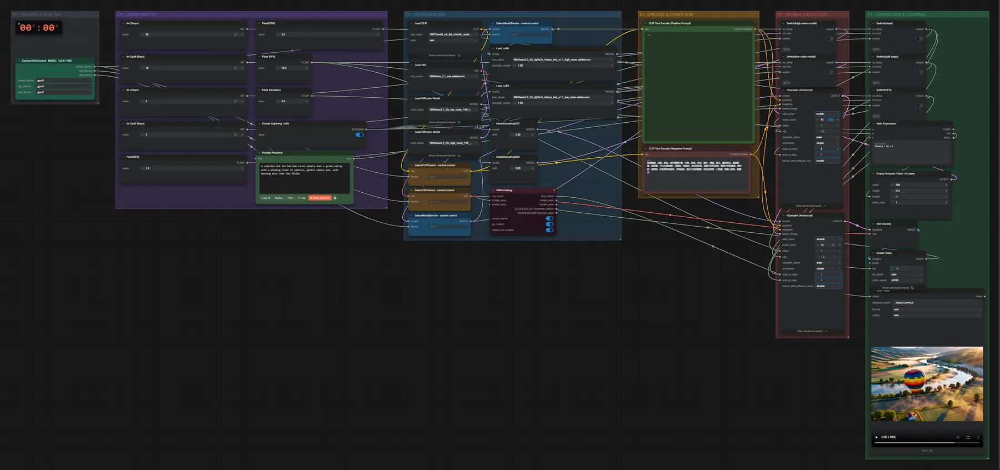

# WAN 2.2 14B (FP8) · Text → Video

**Workflow-Datei:** [`workflows/Text to Video/WAN22_14B_FP8+LightX2V-Text-to-Video.json`](../../../workflows/Text%20to%20Video/WAN22_14B_FP8%2BLightX2V-Text-to-Video.json)  
**Kategorie:** Text to Video · **Eingabe → Ausgabe:** Text → Video · **Quant:** FP8

Bis v1.3.0 hieß der Workflow `WAN22_14B_fp8_lightx2v-Text-to-Video.json`.

WAN 2.2 mit High- und Low-Noise-Modell; mit Lightning-LoRA 4 Schritte, ohne 20 Schritte und CFG 3,5. Kein Ton.

Interaktiv mit Zoom, Vergleichen und Kopier-Buttons: <https://dawasteh.github.io/DaWastehs-ComfyUI-Bundle/#/w/wan22-14b-fp8-lightx2v-text-to-video>

## Modelle

| Rolle | Datei | Quant | Größe |
|---|---|---|---:|
| Text-Encoder / LLM | `umt5_xxl_fp8_e4m3fn_scaled.safetensors` | FP8 | 6,3 GiB |
| VAE | `wan_2.1_vae.safetensors` | BF16 | 0,2 GiB |
| Diffusionsmodell | `wan2.2_t2v_low_noise_14B_fp8_scaled.safetensors` | FP8 | 13,3 GiB |
| Diffusionsmodell | `wan2.2_t2v_high_noise_14B_fp8_scaled.safetensors` | FP8 | 13,3 GiB |
| LoRA | `wan2.2_t2v_lightx2v_4steps_lora_v1.1_high_noise.safetensors` | FP32 | 1,1 GiB |
| LoRA | `wan2.2_t2v_lightx2v_4steps_lora_v1.1_low_noise.safetensors` | FP32 | 1,1 GiB |

## Workflow in ComfyUI

Screenshot nach dem Hauptbeispiel (Eingaben und Ergebnis im Workflow, Erklärungstafeln ausgeblendet):

[](workflow.webp)

## Beispiele

### Heißluftballon

Prompt:

```text
A colorful hot air balloon rises slowly over a green valley with a winding river at sunrise, gentle camera pan, soft morning mist over the fields
```

Negativ:

```text
色调艳丽，过曝，静态，细节模糊不清，字幕，风格，作品，画作，画面，静止，整体发灰，最差质量，低质量，JPEG压缩残留，丑陋的，残缺的，多余的手指，画得不好的手部，画得不好的脸部，畸形的，毁容的，形态畸形的肢体，手指融合，静止不动的画面，杂乱的背景，三条腿，背景人很多，倒着走，
```

| Einstellung | Wert |
|---|---|
| duration | 5 s |
| seed | 42 |
| shift | 5.000000000000001 |
| steps | 4 |
| cfg | 1 |
| sampler_name | euler |
| scheduler | simple |
| Dauer (Ausführung) | 2 min 23 s |
| VRAM R9700 (belegt / PyTorch-Spitze) | 20,9 GiB / 17,8 GiB |
| RAM (ComfyUI-Prozess) | 36,3 GiB |

Lightning-LoRA eingeschaltet (4 Schritte, CFG 1) – im Workflow standardmäßig aus.

Ausgabe · Ausgabe: [balloon.mp4](balloon.mp4)
