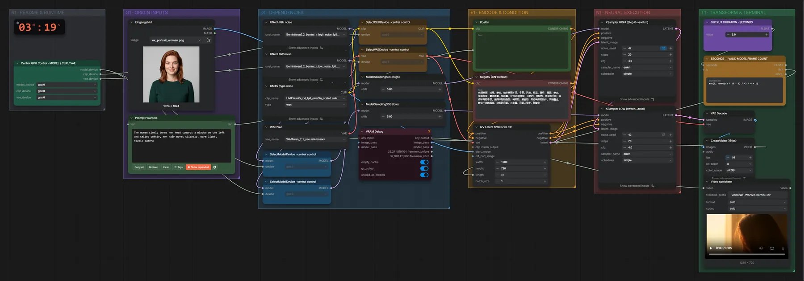

# Bernini-R 14B (FP8) · Bild + Text → Video

**Workflow-Datei:** [`workflows/Text+Image to Video/Bernini_R_14B_FP8-Text+Image-to-Video.json`](../../../workflows/Text%2BImage%20to%20Video/Bernini_R_14B_FP8-Text%2BImage-to-Video.json)  
**Kategorie:** Text+Image to Video · **Eingabe → Ausgabe:** Bild + Text → Video · **Quant:** FP8

Bis v1.3.0 hieß der Workflow `WAN22_bernini_i2v-Text+Image-to-Video.json`.

Bernini-R als klassisches Image-to-Video (High/Low-Noise, 20 Schritte, CFG 4).

Interaktiv mit Zoom, Vergleichen und Kopier-Buttons: <https://dawasteh.github.io/DaWastehs-ComfyUI-Bundle/#/w/bernini-r-14b-fp8-text-image-to-video>

## Modelle

| Rolle | Datei | Quant | Größe |
|---|---|---|---:|
| Diffusionsmodell | `wan2.2_bernini_r_high_noise_fp8_scaled.safetensors` | FP8 | 14,5 GiB |
| Diffusionsmodell | `wan2.2_bernini_r_low_noise_fp8_scaled.safetensors` | FP8 | 14,5 GiB |
| Text-Encoder / LLM | `umt5_xxl_fp8_e4m3fn_scaled.safetensors` | FP8 | 6,3 GiB |
| VAE | `wan_2.1_vae.safetensors` | BF16 | 0,2 GiB |

## Workflow in ComfyUI

Screenshot nach dem Hauptbeispiel (Eingaben und Ergebnis im Workflow, Erklärungstafeln ausgeblendet):

[](workflow.webp)

## Beispiele

### Blick zum Fenster

Prompt:

```text
The woman slowly turns her head towards a window on the left and smiles softly, her hair moves slightly, warm light, static camera
```

Negativ:

```text
色调艳丽，过曝，静态，细节模糊不清，字幕，风格，作品，画作，画面，静止，整体发灰，最差质量，低质量，JPEG压缩残留，丑陋的，残缺的，多余的手指，画得不好的手部，画得不好的脸部，畸形的，毁容的，形态畸形的肢体，手指融合，静止不动的画面，杂乱的背景，三条腿，背景人很多，倒着走
```

| Einstellung | Wert |
|---|---|
| duration | 5 s |
| seed | 42 |
| shift | 5 |
| steps | 20 |
| cfg | 4 |
| sampler_name | euler |
| scheduler | simple |
| Dauer (Ausführung) | 57 min 9 s |
| VRAM R9700 (belegt / PyTorch-Spitze) | 30,0 GiB / 21,6 GiB |
| VRAM RX 9070 XT (belegt / PyTorch-Spitze) | 2,5 GiB / 0,1 GiB |
| RAM (ComfyUI-Prozess) | 32,2 GiB |

Eingabe · ex_portrait_woman.png:  ([Datei](input_ex_portrait_woman.webp))  
Ausgabe · Video speichern: [window.mp4](window.mp4)
