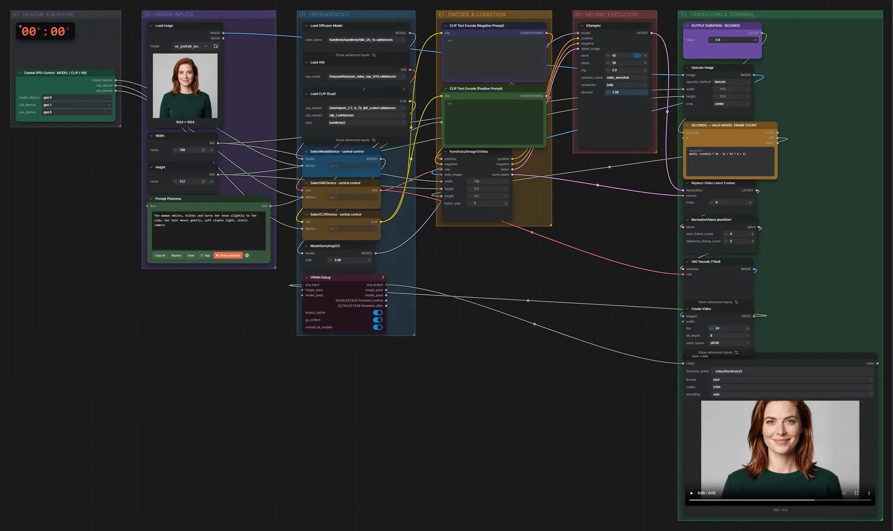

# Kandinsky 5 Lite · Bild + Text → Video

**Workflow-Datei:** [`workflows/Text+Image to Video/Kandinsky5_Lite_BF16-Text+Image-to-Video.json`](../../../workflows/Text%2BImage%20to%20Video/Kandinsky5_Lite_BF16-Text%2BImage-to-Video.json)  
**Kategorie:** Text+Image to Video · **Eingabe → Ausgabe:** Bild + Text → Video · **Quant:** BF16

Bis v1.3.0 hieß der Workflow `Kandinsky5_Lite-Text+Image-to-Video.json`.

Kandinsky 5 Lite (I2V, 5 s) animiert ein Startbild nach Prompt; 50 Schritte, 768×512.

Interaktiv mit Zoom, Vergleichen und Kopier-Buttons: <https://dawasteh.github.io/DaWastehs-ComfyUI-Bundle/#/w/kandinsky5-lite-bf16-text-image-to-video>

## Modelle

| Rolle | Datei | Quant | Größe |
|---|---|---|---:|
| Diffusionsmodell | `kandinsky5lite_i2v_5s.safetensors` | BF16 | 4,3 GiB |
| VAE | `hunyuan_video_vae_bf16.safetensors` | BF16 | 0,5 GiB |
| Text-Encoder | `qwen_2.5_vl_7b_fp8_scaled.safetensors` | FP8 | 8,7 GiB |
| Text-Encoder | `clip_l.safetensors` | FP16 | 0,2 GiB |

## Workflow in ComfyUI

Screenshot nach dem Hauptbeispiel (Eingaben und Ergebnis im Workflow, Erklärungstafeln ausgeblendet):

[](workflow.webp)

## Beispiele

### Porträt wird lebendig

Prompt:

```text
The woman smiles, blinks and turns her head slightly to the side, her hair moves gently, soft studio light, static camera
```

| Einstellung | Wert |
|---|---|
| duration | 5 s |
| seed | 42 |
| shift | 5 |
| steps | 50 |
| cfg | 5 |
| sampler_name | euler_ancestral |
| scheduler | beta |
| denoise | 1 |
| Dauer (Ausführung) | 19 min 11 s |
| VRAM R9700 (belegt / PyTorch-Spitze) | 18,9 GiB / 12,4 GiB |
| VRAM RX 9070 XT (belegt / PyTorch-Spitze) | 10,4 GiB / 9,1 GiB |
| RAM (ComfyUI-Prozess) | 22,0 GiB |

Eingabe · ex_portrait_woman.png:  ([Datei](input_ex_portrait_woman.webp))  
Ausgabe · Ausgabe: [smile.mp4](smile.mp4)
