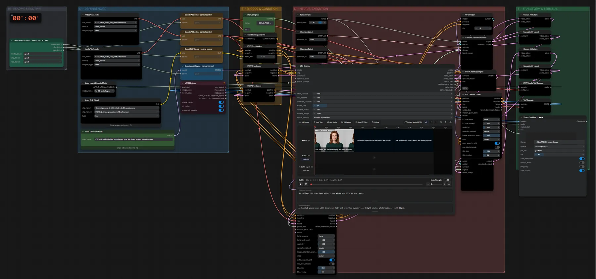

# LTX-2.3 Director · Zeitleisten-Prompt erneut abspielen

**Workflow-Datei:** [`workflows/Text+Image to Video/LTX23_22B_Distilled_FP8-Text+Image-to-Video-Director-Replay.json`](../../../workflows/Text%2BImage%20to%20Video/LTX23_22B_Distilled_FP8-Text%2BImage-to-Video-Director-Replay.json)  
**Kategorie:** Text+Image to Video · **Eingabe → Ausgabe:** Text → Video + Audio · **Quant:** FP8

Bis v1.3.0 hieß der Workflow `LTX23_Director-Prompt-Replay.json`.

Spielt eine gespeicherte Director-Zeitleiste (Szenen-Prompts mit Zeitpunkten) erneut ab.

Interaktiv mit Zoom, Vergleichen und Kopier-Buttons: <https://dawasteh.github.io/DaWastehs-ComfyUI-Bundle/#/w/ltx23-22b-distilled-fp8-text-image-to-video-director-replay>

## Modelle

| Rolle | Datei | Quant | Größe |
|---|---|---|---:|
| VAE | `LTX23_audio_vae_bf16.safetensors` | BF16 | 0,3 GiB |
| VAE | `LTX23_video_vae_bf16.safetensors` | BF16 | 1,4 GiB |
| Latent-Upscaler | `ltx-2.3-spatial-upscaler-x2-1.1.safetensors` | BF16 | 0,9 GiB |
| Text-Encoder | `gemma_3_12B_it_fp8_e4m3fn.safetensors` | FP8 | 12,3 GiB |
| Text-Encoder | `ltx-2.3_text_projection_bf16.safetensors` | BF16 | 2,1 GiB |
| Diffusionsmodell | `ltx-2.3-22b-distilled_transformer_only_fp8_input_scaled_v3.safetensors` | FP8 | 23,3 GiB |

## Workflow in ComfyUI

Screenshot nach dem Hauptbeispiel (Eingaben und Ergebnis im Workflow, Erklärungstafeln ausgeblendet):

## Beispiele

### Replay · Porträt + zwei Textsegmente

| Einstellung | Wert |
|---|---|
| global prompt | A cheerful young woman with long brown hair and a knitted sweater in a bright studio, photorealistic, soft light. |
| segmente | 40 Frames: She smiles, tilts her head slightly and winks playfully at the camera. | 40 Frames: She brings both hands to her cheeks and laughs. | 40 Frames: She blows a kiss to the camera and waves goodbye. |
| duration | 5 s (120 Frames) |
| size | 720 × 1280 |
| seed | 42 |
| sampler_name | euler |
| scheduler | linear_quadratic |
| steps | 8 |
| denoise | 1 |
| cfg | 1 |
| Dauer (Ausführung) | 3 min 32 s |
| VRAM R9700 (belegt / PyTorch-Spitze) | 30,2 GiB / 26,5 GiB |
| RAM (ComfyUI-Prozess) | 35,2 GiB |

Eigenes Porträt statt des Beispielbilds; Timeline auf 5 s (3 × 40 Frames).

Eingabe · ex_portrait_woman.png:  ([Datei](input_ex_portrait_woman.webp))  
Ausgabe · Ausgabe: [woman-replay.mp4](woman-replay.mp4)
