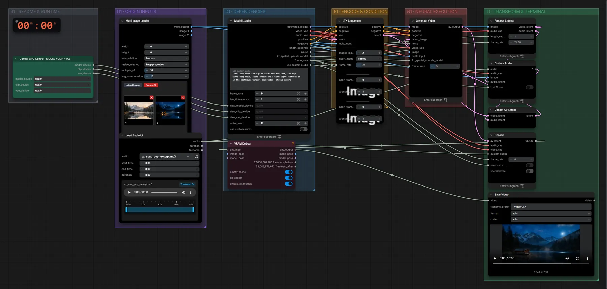

# LTX-2.3 22B (FP8) · erstes + letztes Bild → Video

**Workflow-Datei:** [`workflows/Text+Image to Video/LTX23_22B_FP8-First+Last-Frame+Audio-to-Video.json`](../../../workflows/Text%2BImage%20to%20Video/LTX23_22B_FP8-First%2BLast-Frame%2BAudio-to-Video.json)  
**Kategorie:** Text+Image to Video · **Eingabe → Ausgabe:** Bild + Text → Video + Audio · **Quant:** FP8

Bis v1.3.0 hieß der Workflow `LTX23_First+Last-Frame-Custom-Audio.json`.

Start- und Endbild vorgeben, LTX-2.3 füllt die Bewegung dazwischen; optional mit eigener Tonspur.

Interaktiv mit Zoom, Vergleichen und Kopier-Buttons: <https://dawasteh.github.io/DaWastehs-ComfyUI-Bundle/#/w/ltx23-22b-fp8-first-last-frame-audio-to-video>

## Modelle

| Rolle | Datei | Quant | Größe |
|---|---|---|---:|
| Modell | `ltx-2.3-22b-dev-fp8.safetensors` | FP8 | 27,1 GiB |
| Latent-Upscaler | `ltx-2.3-spatial-upscaler-x2-1.1.safetensors` | BF16 | 0,9 GiB |
| LoRA | `ltx_2.3_22b_distilled_1.1_lora_dynamic_fro09_avg_rank_111_bf16.safetensors` | BF16 | 2,5 GiB |
| VAE | `taeltx2_3.safetensors` | FP16 | 0,0 GiB |
| VAE | `LTX23_video_vae_bf16.safetensors` | BF16 | 1,4 GiB |
| VAE | `LTX23_audio_vae_bf16.safetensors` | BF16 | 0,3 GiB |
| Text-Encoder | `gemma_3_12B_it_fp4_mixed.safetensors` | FP4 mixed | 8,8 GiB |

## Workflow in ComfyUI

Screenshot nach dem Hauptbeispiel (Eingaben und Ergebnis im Workflow, Erklärungstafeln ausgeblendet):

[](workflow.webp)

## Beispiele

### Erstes + letztes Bild → Video

Prompt:

```text
Time-lapse over the alpine lake: the sun sets, the sky turns deep blue, stars appear and a warm light switches on in the boathouse window, calm water, static camera
```

| Einstellung | Wert |
|---|---|
| duration | 5 s |
| seed | 42 |
| Dauer (Ausführung) | 2 min 49 s |
| VRAM R9700 (belegt / PyTorch-Spitze) | 30,3 GiB / 26,0 GiB |
| VRAM RX 9070 XT (belegt / PyTorch-Spitze) | 4,4 GiB / 2,2 GiB |
| RAM (ComfyUI-Prozess) | 34,1 GiB |

Eigene Tonspur aus (Standard); die Bilder kommen über den Multi-Image-Loader (Pfade im Eingabeordner).

Eingabe · ex_landscape_lake.png:  ([Datei](input_ex_landscape_lake.webp))  
Eingabe · ex_landscape_lake_night.png:  ([Datei](input_ex_landscape_lake_night.webp))  
Eingabe · ex_song_pop_excerpt.mp3: [input_ex_song_pop_excerpt.mp3](input_ex_song_pop_excerpt.mp3)  
Ausgabe · Ausgabe: [day-night.mp4](day-night.mp4)
