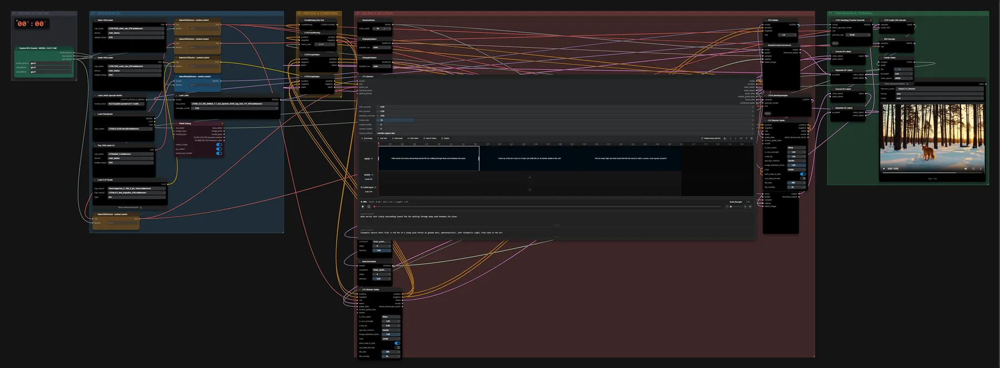

# LTX-2.3 Director (FP8) · Zeitleiste → Video, zweistufig

**Workflow-Datei:** [`workflows/Text+Image to Video/LTX23_22B_FP8-Text+Image-to-Video-Director-2-Stage.json`](../../../workflows/Text%2BImage%20to%20Video/LTX23_22B_FP8-Text%2BImage-to-Video-Director-2-Stage.json)  
**Kategorie:** Text+Image to Video · **Eingabe → Ausgabe:** Text + Bild → Video + Audio · **Quant:** FP8

Bis v1.3.0 hieß der Workflow `LTX23_Director_fp8-2-Stage.json`.

Zeitleiste mit Szenen-Prompts, erster Durchgang in halber Größe, zweiter im 2×-Upscaler.

Interaktiv mit Zoom, Vergleichen und Kopier-Buttons: <https://dawasteh.github.io/DaWastehs-ComfyUI-Bundle/#/w/ltx23-22b-fp8-text-image-to-video-director-2-stage>

## Modelle

| Rolle | Datei | Quant | Größe |
|---|---|---|---:|
| LoRA | `ltx_2.3_22b_distilled_1.1_lora_dynamic_fro09_avg_rank_111_bf16.safetensors` | BF16 | 2,5 GiB |
| VAE | `LTX23_audio_vae_bf16.safetensors` | BF16 | 0,3 GiB |
| VAE | `LTX23_video_vae_bf16.safetensors` | BF16 | 1,4 GiB |
| VAE | `taeltx2_3.safetensors` | FP16 | 0,0 GiB |
| Latent-Upscaler | `ltx-2.3-spatial-upscaler-x2-1.1.safetensors` | BF16 | 0,9 GiB |
| Text-Encoder | `gemma_3_12B_it_fp4_mixed.safetensors` | FP4 mixed | 8,8 GiB |
| Text-Encoder | `ltx-2.3_text_projection_bf16.safetensors` | BF16 | 2,1 GiB |
| Modell | `ltx-2.3-22b-dev-fp8.safetensors` | FP8 | 27,1 GiB |

## Workflow in ComfyUI

Screenshot nach dem Hauptbeispiel (Eingaben und Ergebnis im Workflow, Erklärungstafeln ausgeblendet):

## Beispiele

### Timeline · drei Textsegmente

| Einstellung | Wert |
|---|---|
| global prompt | Cinematic nature short film. A red fox in a snowy pine forest at golden hour, photorealistic, soft volumetric light, fine snow in the air. |
| segmente | 40 Frames: Wide aerial shot slowly descending toward the fox walking through deep snow between the pines. | 40 Frames: Close-up of the fox's face as it stops and sniffs the air, its breath visible in the cold. | 40 Frames: The fox leaps high and dives head-first into the snow to catch a mouse, snow sprays around it. |
| duration | 5 s (120 Frames) |
| seed | 42 |
| scheduler | linear_quadratic |
| sampler_name | euler |
| cfg | 1 |
| Dauer (Ausführung) | 2 min 3 s |
| VRAM R9700 (belegt / PyTorch-Spitze) | 30,2 GiB / 27,2 GiB |
| VRAM RX 9070 XT (belegt / PyTorch-Spitze) | 2,6 GiB / 0,1 GiB |
| RAM (ComfyUI-Prozess) | 34,2 GiB |

Timeline auf 5 s gekürzt (3 × 40 Frames) und mit eigenem Inhalt statt der Beispiel-Timeline gefüllt.

Ausgabe · Ausgabe: [fox-timeline.mp4](fox-timeline.mp4)
