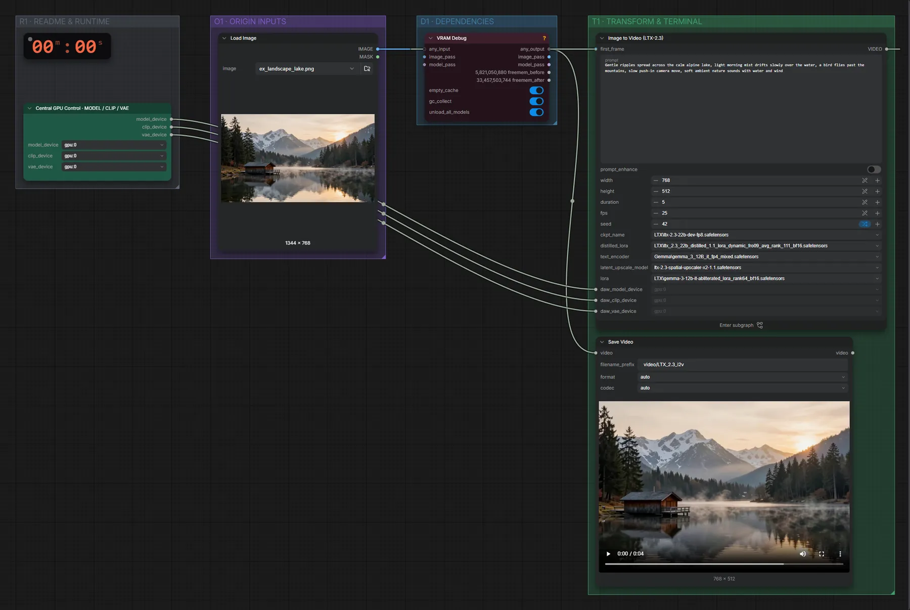

# LTX-2.3 22B (FP8) · Bild + Text → Video mit Ton

**Workflow-Datei:** [`workflows/Text+Image to Video/LTX23_22B_FP8-Text+Image-to-Video.json`](../../../workflows/Text%2BImage%20to%20Video/LTX23_22B_FP8-Text%2BImage-to-Video.json)  
**Kategorie:** Text+Image to Video · **Eingabe → Ausgabe:** Bild + Text → Video + Audio · **Quant:** FP8

Bis v1.3.0 hieß der Workflow `LTX23-Image-to-Video.json`.

Startbild plus Prompt, LTX-2.3 dev mit destillierter LoRA und 2×-Latent-Upscaler; Ton entsteht mit.

Interaktiv mit Zoom, Vergleichen und Kopier-Buttons: <https://dawasteh.github.io/DaWastehs-ComfyUI-Bundle/#/w/ltx23-22b-fp8-text-image-to-video>

## Modelle

| Rolle | Datei | Quant | Größe |
|---|---|---|---:|
| Audio-VAE | `ltx-2.3-22b-dev-fp8.safetensors` | FP8 | 27,1 GiB |
| LoRA | `ltx_2.3_22b_distilled_1.1_lora_dynamic_fro09_avg_rank_111_bf16.safetensors` | BF16 | 2,5 GiB |
| Latent-Upscaler | `ltx-2.3-spatial-upscaler-x2-1.1.safetensors` | BF16 | 0,9 GiB |
| Text-Encoder | `gemma_3_12B_it_fp4_mixed.safetensors` | FP4 mixed | 8,8 GiB |
| LoRA | `gemma-3-12b-it-abliterated_lora_rank64_bf16.safetensors` | BF16 | 0,6 GiB |

## Workflow in ComfyUI

Screenshot nach dem Hauptbeispiel (Eingaben und Ergebnis im Workflow, Erklärungstafeln ausgeblendet):

[](workflow.webp)

## Beispiele

### Bergsee mit Ton

Prompt:

```text
Gentle ripples spread across the calm alpine lake, light morning mist drifts slowly over the water, a bird flies past the mountains, slow push-in camera move, soft ambient nature sounds with water and wind
```

| Einstellung | Wert |
|---|---|
| duration | 5 s |
| seed | 42 |
| Dauer (Ausführung) | 1 min 49 s |
| VRAM R9700 (belegt / PyTorch-Spitze) | 30,4 GiB / 27,3 GiB |
| RAM (ComfyUI-Prozess) | 33,4 GiB |

Eingabe · ex_landscape_lake.png:  ([Datei](input_ex_landscape_lake.webp))  
Ausgabe · Ausgabe: [lake.mp4](lake.mp4)  

PreviewAny:

```text
Gentle ripples spread across the calm alpine lake, light morning mist drifts slowly over the water, a bird flies past the mountains, slow push-in camera move, soft ambient nature sounds with water and wind
```
