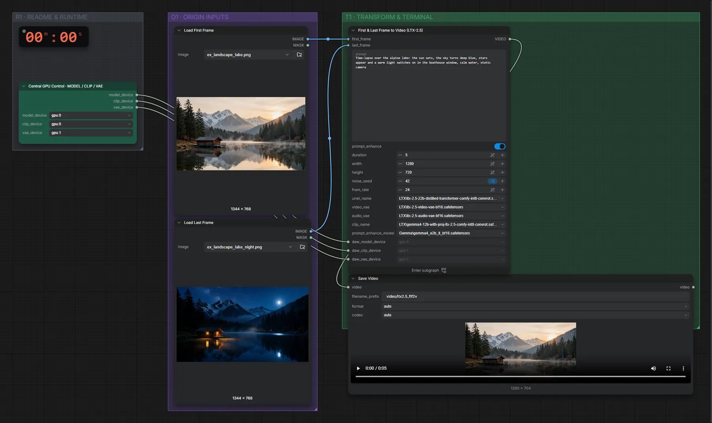

# LTX-2.5 22B (INT8) · erstes + letztes Bild → Video

**Workflow-Datei:** [`workflows/Text+Image to Video/LTX25_22B_INT8-First+Last-Frame-to-Video.json`](../../../workflows/Text%2BImage%20to%20Video/LTX25_22B_INT8-First%2BLast-Frame-to-Video.json)  
**Kategorie:** Text+Image to Video · **Eingabe → Ausgabe:** Bild + Text → Video + Audio · **Quant:** INT8

Bis v1.3.0 hieß der Workflow `LTX25_INT8_ConvRot-First+Last-Frame-to-Video.json`.

Start- und Endbild plus Prompt; LTX-2.5 erzeugt Übergang und Ton.

Interaktiv mit Zoom, Vergleichen und Kopier-Buttons: <https://dawasteh.github.io/DaWastehs-ComfyUI-Bundle/#/w/ltx25-22b-int8-first-last-frame-to-video>

## Modelle

| Rolle | Datei | Quant | Größe |
|---|---|---|---:|
| Modell | `ltx-2.5-22b-distilled-transformer-comfy-int8-convrot.safetensors` | INT8 | 20,0 GiB |
| Modell | `ltx-2.5-video-vae-bf16.safetensors` | BF16 | 1,4 GiB |
| Modell | `ltx-2.5-audio-vae-bf16.safetensors` | BF16 | 0,3 GiB |
| Modell | `gemma4-12b-with-proj-ltx-2.5-comfy-int8-convrot.safetensors` | INT8 | 14,3 GiB |
| Modell | `gemma4_e2b_it_bf16.safetensors` | BF16 | 9,6 GiB |

## Workflow in ComfyUI

Screenshot nach dem Hauptbeispiel (Eingaben und Ergebnis im Workflow, Erklärungstafeln ausgeblendet):

[](workflow.webp)

## Beispiele

### Tag → Nacht (erstes + letztes Bild)

Prompt:

```text
Time-lapse over the alpine lake: the sun sets, the sky turns deep blue, stars appear and a warm light switches on in the boathouse window, calm water, static camera
```

| Einstellung | Wert |
|---|---|
| duration | 5 s |
| seed | 42 |
| Dauer (Ausführung) | 3 min 18 s |
| VRAM R9700 (belegt / PyTorch-Spitze) | 26,7 GiB / 24,1 GiB |
| VRAM RX 9070 XT (belegt / PyTorch-Spitze) | 8,2 GiB / 5,1 GiB |
| RAM (ComfyUI-Prozess) | 35,8 GiB |

Eingabe · Erstes Bild:  ([Datei](input_ex_landscape_lake.webp))  
Eingabe · Letztes Bild:  ([Datei](input_ex_landscape_lake_night.webp))  
Ausgabe · Ausgabe: [day-night.mp4](day-night.mp4)  

PreviewAny:

```text
A wide shot captures a serene alpine lake reflecting the fading light of sunset; the sky is transitioning from warm orange and yellow near the horizon to deepening hues of blue, with snow-capped mountains rising in the distance under soft atmospheric haze, and dark evergreen forests bordering the shore; a small, rustic wooden boathouse sits near the water's edge, its weathered wood contrasting with the calm, mirror-like surface of the water which shows clear reflections of the landscape; as the time-lapse begins, the sun descends rapidly, causing the sky to shift dramatically to a deep, rich blue, and numerous bright stars begin to emerge across the darkening expanse; simultaneously, a warm, inviting light illuminates inside the boathouse through a window, casting a golden glow onto the still water, while the camera remains static, emphasizing the tranquil stillness of the water and the gradual celestial change, accompanied by a soft, ambient orchestral score swelling gently as the transition occurs.
```
