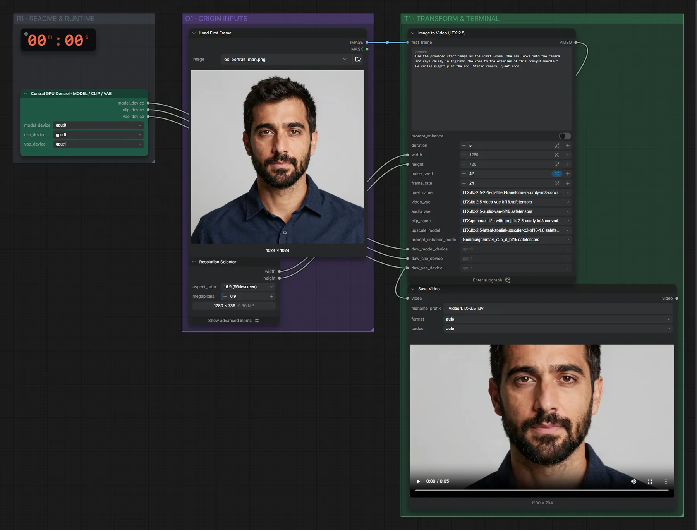

# LTX-2.5 22B (INT8) · Bild + Text → Video mit Ton

**Workflow-Datei:** [`workflows/Text+Image to Video/LTX25_22B_INT8-Text+Image-to-Video.json`](../../../workflows/Text%2BImage%20to%20Video/LTX25_22B_INT8-Text%2BImage-to-Video.json)  
**Kategorie:** Text+Image to Video · **Eingabe → Ausgabe:** Bild + Text → Video + Audio · **Quant:** INT8

Bis v1.3.0 hieß der Workflow `LTX25_INT8_ConvRot-Image-to-Video.json`.

Startbild plus Prompt; LTX-2.5 kann Figuren auch sprechen lassen (Sätze in Anführungszeichen im Prompt).

Interaktiv mit Zoom, Vergleichen und Kopier-Buttons: <https://dawasteh.github.io/DaWastehs-ComfyUI-Bundle/#/w/ltx25-22b-int8-text-image-to-video>

## Modelle

| Rolle | Datei | Quant | Größe |
|---|---|---|---:|
| Modell | `ltx-2.5-22b-distilled-transformer-comfy-int8-convrot.safetensors` | INT8 | 20,0 GiB |
| Modell | `ltx-2.5-video-vae-bf16.safetensors` | BF16 | 1,4 GiB |
| Modell | `ltx-2.5-audio-vae-bf16.safetensors` | BF16 | 0,3 GiB |
| Modell | `gemma4-12b-with-proj-ltx-2.5-comfy-int8-convrot.safetensors` | INT8 | 14,3 GiB |
| Modell | `ltx-2.5-latent-spatial-upscaler-x2-bf16-1.0.safetensors` | BF16 | 0,9 GiB |
| Modell | `gemma4_e2b_it_bf16.safetensors` | BF16 | 9,6 GiB |

## Workflow in ComfyUI

Screenshot nach dem Hauptbeispiel (Eingaben und Ergebnis im Workflow, Erklärungstafeln ausgeblendet):

[](workflow.webp)

## Beispiele

### Porträt spricht (Ton aus dem Modell)

Prompt:

```text
Use the provided start image as the first frame. The man looks into the camera and says calmly in English: "Welcome to the examples of this ComfyUI bundle." He smiles slightly at the end. Static camera, quiet room.
```

| Einstellung | Wert |
|---|---|
| duration | 5 s |
| seed | 42 |
| Dauer (Ausführung) | 2 min 14 s |
| VRAM R9700 (belegt / PyTorch-Spitze) | 25,6 GiB / 22,1 GiB |
| VRAM RX 9070 XT (belegt / PyTorch-Spitze) | 8,2 GiB / 5,1 GiB |
| RAM (ComfyUI-Prozess) | 33,1 GiB |

Prompt-Enhancer aus, damit der gesprochene Satz genau so übernommen wird.

Eingabe · ex_portrait_man.png:  ([Datei](input_ex_portrait_man.webp))  
Ausgabe · Ausgabe: [talk.mp4](talk.mp4)  

PreviewAny:

```text
Use the provided start image as the first frame. The man looks into the camera and says calmly in English: "Welcome to the examples of this ComfyUI bundle." He smiles slightly at the end. Static camera, quiet room.
```
