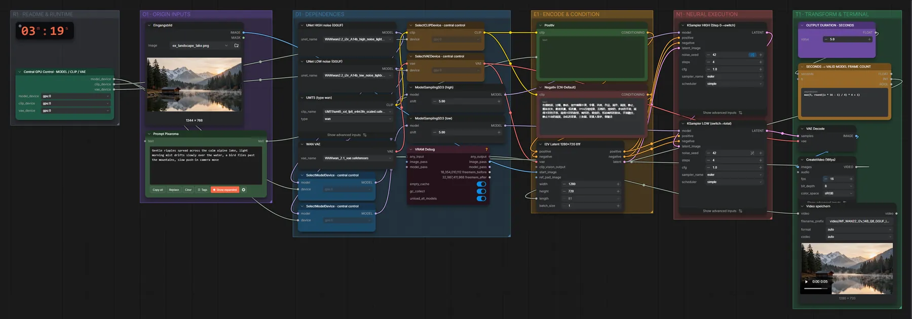

# WAN 2.2 I2V 14B (GGUF Q8_0) · Bild + Text → Video

**Workflow-Datei:** [`workflows/Text+Image to Video/WAN22_I2V_14B_Q8_0_LightX2V-Text+Image-to-Video.json`](../../../workflows/Text%2BImage%20to%20Video/WAN22_I2V_14B_Q8_0_LightX2V-Text%2BImage-to-Video.json)  
**Kategorie:** Text+Image to Video · **Eingabe → Ausgabe:** Bild + Text → Video · **Quant:** GGUF Q8_0

Bis v1.3.0 hieß der Workflow `WAN22_i2v_14B_Q8_GGUF_lightx2v-Text+Image-to-Video.json`.

WAN 2.2 I2V mit eingebackener LightX2V-Destillation als GGUF Q8_0; 4 Schritte, 1280×720.

Interaktiv mit Zoom, Vergleichen und Kopier-Buttons: <https://dawasteh.github.io/DaWastehs-ComfyUI-Bundle/#/w/wan22-i2v-14b-q8-0-lightx2v-text-image-to-video>

## Modelle

| Rolle | Datei | Quant | Größe |
|---|---|---|---:|
| Diffusionsmodell | `wan2.2_i2v_A14b_high_noise_lightx2v_4step_720p_260412-Q8_0.gguf` | Q8_0 (GGUF) | 14,4 GiB |
| Diffusionsmodell | `wan2.2_i2v_A14b_low_noise_lightx2v_4step_720p_260412-Q8_0.gguf` | Q8_0 (GGUF) | 14,4 GiB |
| Text-Encoder / LLM | `umt5_xxl_fp8_e4m3fn_scaled.safetensors` | FP8 | 6,3 GiB |
| VAE | `wan_2.1_vae.safetensors` | BF16 | 0,2 GiB |

## Workflow in ComfyUI

Screenshot nach dem Hauptbeispiel (Eingaben und Ergebnis im Workflow, Erklärungstafeln ausgeblendet):

[](workflow.webp)

## Beispiele

### Bergsee wird lebendig

Prompt:

```text
Gentle ripples spread across the calm alpine lake, light morning mist drifts slowly over the water, a bird flies past the mountains, slow push-in camera move
```

Negativ:

```text
色调艳丽，过曝，静态，细节模糊不清，字幕，风格，作品，画作，画面，静止，整体发灰，最差质量，低质量，JPEG压缩残留，丑陋的，残缺的，多余的手指，画得不好的手部，画得不好的脸部，畸形的，毁容的，形态畸形的肢体，手指融合，静止不动的画面，杂乱的背景，三条腿，背景人很多，倒着走
```

| Einstellung | Wert |
|---|---|
| duration | 5 s |
| seed | 42 |
| shift | 5 |
| steps | 4 |
| cfg | 1 |
| sampler_name | euler |
| scheduler | simple |
| Dauer (Ausführung) | 7 min 42 s |
| VRAM R9700 (belegt / PyTorch-Spitze) | 30,5 GiB / 25,3 GiB |
| VRAM RX 9070 XT (belegt / PyTorch-Spitze) | 2,5 GiB / 0,1 GiB |
| RAM (ComfyUI-Prozess) | 32,0 GiB |

Eingabe · ex_landscape_lake.png:  ([Datei](input_ex_landscape_lake.webp))  
Ausgabe · Video speichern: [lake.mp4](lake.mp4)
