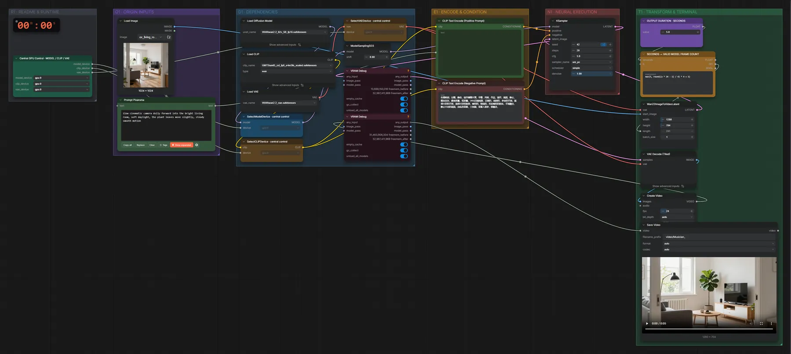
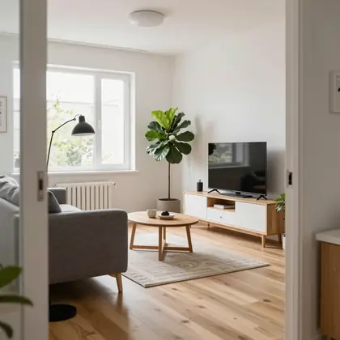

# WAN 2.2 TI2V 5B (FP16) · Bild + Text → Video

**Workflow-Datei:** [`workflows/Text+Image to Video/WAN22_TI2V_5B_FP16-Text+Image-to-Video.json`](../../../workflows/Text%2BImage%20to%20Video/WAN22_TI2V_5B_FP16-Text%2BImage-to-Video.json)  
**Kategorie:** Text+Image to Video · **Eingabe → Ausgabe:** Bild + Text → Video · **Quant:** FP16

Bis v1.3.0 hieß der Workflow `WAN22_5B-Text+Image-to-Video.json`.

Das kleine WAN 2.2 (5B) mit eigenem VAE; 1280×704, 24 fps, 20 Schritte.

Interaktiv mit Zoom, Vergleichen und Kopier-Buttons: <https://dawasteh.github.io/DaWastehs-ComfyUI-Bundle/#/w/wan22-ti2v-5b-fp16-text-image-to-video>

## Modelle

| Rolle | Datei | Quant | Größe |
|---|---|---|---:|
| Diffusionsmodell | `wan2.2_ti2v_5B_fp16.safetensors` | FP16 | 9,3 GiB |
| Text-Encoder / LLM | `umt5_xxl_fp8_e4m3fn_scaled.safetensors` | FP8 | 6,3 GiB |
| VAE | `wan2.2_vae.safetensors` | FP16 | 1,3 GiB |

## Workflow in ComfyUI

Screenshot nach dem Hauptbeispiel (Eingaben und Ergebnis im Workflow, Erklärungstafeln ausgeblendet):

[](workflow.webp)

## Beispiele

### Kamerafahrt durchs Wohnzimmer

Prompt:

```text
Slow cinematic camera dolly forward into the bright living room, soft daylight, the plant leaves move slightly, steady smooth motion
```

Negativ:

```text
色调艳丽，过曝，静态，细节模糊不清，字幕，风格，作品，画作，画面，静止，整体发灰，最差质量，低质量，JPEG压缩残留，丑陋的，残缺的，多余的手指，画得不好的手部，画得不好的脸部，畸形的，毁容的，形态畸形的肢体，手指融合，静止不动的画面，杂乱的背景，三条腿，背景人很多，倒着走，
```

| Einstellung | Wert |
|---|---|
| duration | 5 s |
| seed | 42 |
| steps | 20 |
| cfg | 5 |
| sampler_name | uni_pc |
| scheduler | simple |
| denoise | 1 |
| shift | 8 |
| Dauer (Ausführung) | 6 min 4 s |
| VRAM R9700 (belegt / PyTorch-Spitze) | 24,9 GiB / 21,8 GiB |
| VRAM RX 9070 XT (belegt / PyTorch-Spitze) | 2,5 GiB / 0,1 GiB |
| RAM (ComfyUI-Prozess) | 19,8 GiB |

Eingabe · ex_living_room.png:  ([Datei](input_ex_living_room.webp))  
Ausgabe · Ausgabe: [dolly.mp4](dolly.mp4)
