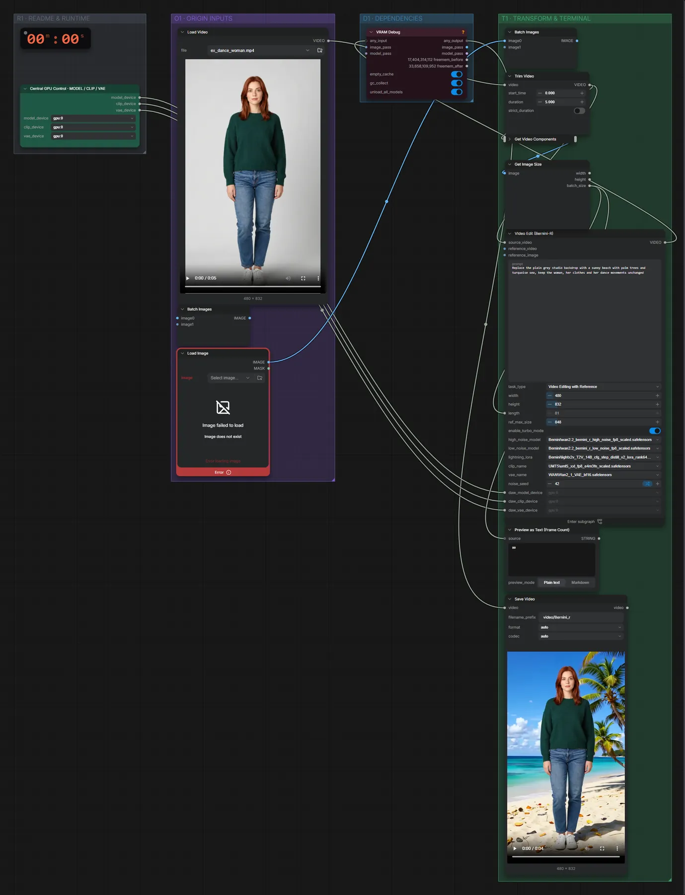

# Bernini-R 14B (FP8) · Video per Text bearbeiten

**Workflow-Datei:** [`workflows/Video Editing/Bernini_R_14B_FP8-Video+Text-to-Video-Edit.json`](../../../workflows/Video%20Editing/Bernini_R_14B_FP8-Video%2BText-to-Video-Edit.json)  
**Kategorie:** Video Editing · **Eingabe → Ausgabe:** Video + Text → Video · **Quant:** FP8

Bis v1.3.0 hieß der Workflow `Bernini_R-Video-Editing.json`.

Hintergrund, Kleidung oder Stil in einem Video per Anweisung ändern, Bewegung bleibt.

Interaktiv mit Zoom, Vergleichen und Kopier-Buttons: <https://dawasteh.github.io/DaWastehs-ComfyUI-Bundle/#/w/bernini-r-14b-fp8-video-text-to-video-edit>

## Modelle

| Rolle | Datei | Quant | Größe |
|---|---|---|---:|
| Text-Encoder / LLM | `umt5_xxl_fp8_e4m3fn_scaled.safetensors` | FP8 | 6,3 GiB |
| VAE | `Wan2_1_VAE_bf16.safetensors` | BF16 | 0,2 GiB |
| LoRA | `lightx2v_T2V_14B_cfg_step_distill_v2_lora_rank64_bf16.safetensors` | BF16 | 0,6 GiB |
| Diffusionsmodell | `wan2.2_bernini_r_high_noise_fp8_scaled.safetensors` | FP8 | 14,5 GiB |
| Diffusionsmodell | `wan2.2_bernini_r_low_noise_fp8_scaled.safetensors` | FP8 | 14,5 GiB |

## Workflow in ComfyUI

Screenshot nach dem Hauptbeispiel (Eingaben und Ergebnis im Workflow, Erklärungstafeln ausgeblendet):

[](workflow.webp)

## Beispiele

### Hintergrund im Video tauschen

Prompt:

```text
Replace the plain grey studio backdrop with a sunny beach with palm trees and turquoise sea, keep the woman, her clothes and her dance movements unchanged
```

| Einstellung | Wert |
|---|---|
| seed | 42 |
| Dauer (Ausführung) | 7 min 16 s |
| VRAM R9700 (belegt / PyTorch-Spitze) | 27,5 GiB / 21,5 GiB |
| RAM (ComfyUI-Prozess) | 36,2 GiB |

Eingabe · ex_dance_woman.mp4: [input_ex_dance_woman.mp4](input_ex_dance_woman.mp4)  
Ausgabe · Ausgabe: [beach.mp4](beach.mp4)  

PreviewAny:

```text
8
```

Preview as Text (Frame Count):

```text
80
```
