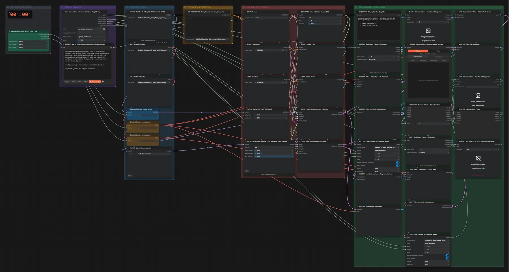

# MiniMax FastH3 (INT8) · Video-Latent-Upscale

**Workflow-Datei:** [`workflows/Video Upscaling/MiniMax_FastH3_INT8-Video-Latent-Upscale.json`](../../../workflows/Video%20Upscaling/MiniMax_FastH3_INT8-Video-Latent-Upscale.json)  
**Kategorie:** Video Upscaling · **Eingabe → Ausgabe:** Video → Video · **Quant:** INT8

Bis v1.3.0 hieß der Workflow `MiniMax_H3-Latent-Upscaler-3D-FastH3.json`.

Beliebig lange Videos in Blöcken an Schnitten: gelernter 3D-Latent-Upscaler plus kurzer FastH3-Durchgang (Denoise 0,25), Block 1 wird vorab geprüft.

Interaktiv mit Zoom, Vergleichen und Kopier-Buttons: <https://dawasteh.github.io/DaWastehs-ComfyUI-Bundle/#/w/minimax-fasth3-int8-video-latent-upscale>

## Modelle

| Rolle | Datei | Quant | Größe |
|---|---|---|---:|
| Diffusionsmodell | `fastvideo_fasth3_8step_v2_pruned_int8_convrot.safetensors` | INT8 | 20,6 GiB |
| VAE | `minimax_h3_video_vae_fp16.safetensors` | FP16 | 4,8 GiB |
| VAE | `minimax_h3_audio_vae_fp32.safetensors` | FP32 | 0,6 GiB |
| Text-Encoder | `qwen3vl_32b_minimax_h3_int8_convrot.safetensors` | INT8 | 25,3 GiB |
| Latent-Upscaler | `minimax_h3_latent_upscaler_3d_conv_v1_bf16.safetensors` | BF16 | 0,6 GiB |

## Workflow in ComfyUI

Screenshot nach dem Hauptbeispiel (Eingaben und Ergebnis im Workflow, Erklärungstafeln ausgeblendet):

[](workflow.webp)

## Beispiele

### 480×832 → ×1,5

| Einstellung | Wert |
|---|---|
| Dauer (Ausführung) | 2 min 31 s |
| VRAM R9700 (belegt / PyTorch-Spitze) | 30,3 GiB / 25,4 GiB |
| RAM (ComfyUI-Prozess) | 29,2 GiB |

Block 1 wird am Pause-Knoten geprüft, dann „Continue“ für den Rest (wie im Workflow vorgesehen).

Eingabe · ex_dance_woman.mp4: [input_ex_dance_woman.mp4](input_ex_dance_woman.mp4)  
Ausgabe · Final · LOOP · Block speichern + Vorschau mit Originalton: [dance__n34.mp4](dance__n34.mp4)  
Ausgabe · Final · VU 4 · HOCHSKALIERTES VIDEO · Originalton unverändert: [dance__n36.mp4](dance__n36.mp4)  
Ausgabe · Pass 1 · BLOCK 1 · Block speichern + Vorschau mit Originalton: [dance__n22.mp4](dance__n22.mp4)  

BLOCKPLAN · Blöcke, Schnitte, Zielgröße:

```text
ex_dance_woman.mp4: 480x832 -> 704x1248 (x1.50), 122 Frames (5.08 s), 2 Blöcke, 0 harte Schnitte erkannt

  1. Frames 0–62 (2.62 s)
  2. Frames 63–121 (2.46 s)
```
