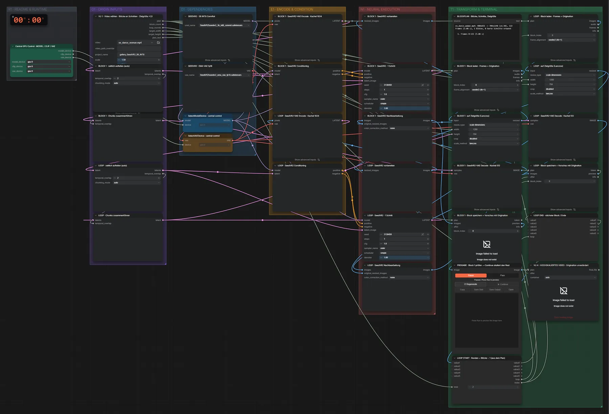

# SeedVR2 3B (INT8) · Video-Upscale

**Workflow-Datei:** [`workflows/Video Upscaling/SeedVR2_3B_INT8-Video-Upscale.json`](../../../workflows/Video%20Upscaling/SeedVR2_3B_INT8-Video-Upscale.json)  
**Kategorie:** Video Upscaling · **Eingabe → Ausgabe:** Video → Video · **Quant:** INT8

Ein-Schritt-Restaurierung und Vergrößerung mit SeedVR2, blockweise mit Originalton.

Interaktiv mit Zoom, Vergleichen und Kopier-Buttons: <https://dawasteh.github.io/DaWastehs-ComfyUI-Bundle/#/w/seedvr2-3b-int8-video-upscale>

## Modelle

| Rolle | Datei | Quant | Größe |
|---|---|---|---:|
| Diffusionsmodell | `seedvr2_3b_int8_convrot.safetensors` | INT8 | 3,2 GiB |
| VAE | `seedvr2_ema_vae_fp16.safetensors` | FP16 | 0,5 GiB |

## Workflow in ComfyUI

Screenshot nach dem Hauptbeispiel (Eingaben und Ergebnis im Workflow, Erklärungstafeln ausgeblendet):

[](workflow.webp)

## Beispiele

### 480×832 → ×1,5

| Einstellung | Wert |
|---|---|
| Dauer (Ausführung) | 9 min 46 s |
| VRAM R9700 (belegt / PyTorch-Spitze) | 23,4 GiB / 15,4 GiB |
| RAM (ComfyUI-Prozess) | 8,2 GiB |

Block 1 wird am Pause-Knoten geprüft, dann „Continue“ für den Rest (wie im Workflow vorgesehen).

Eingabe · ex_dance_woman.mp4: [input_ex_dance_woman.mp4](input_ex_dance_woman.mp4)  
Ausgabe · Final · VU 4 · HOCHSKALIERTES VIDEO · Originalton unverändert: [dance__n30.mp4](dance__n30.mp4)  
Ausgabe · Pass 1 · BLOCK 1 · Block speichern + Vorschau mit Originalton: [dance__n15.mp4](dance__n15.mp4)  

BLOCKPLAN · Blöcke, Schnitte, Zielgröße:

```text
ex_dance_woman.mp4: 480x832 -> 704x1248 (x1.50), 122 Frames (5.08 s), 1 Blöcke, 0 harte Schnitte erkannt

  1. Frames 0–121 (5.08 s)
```
