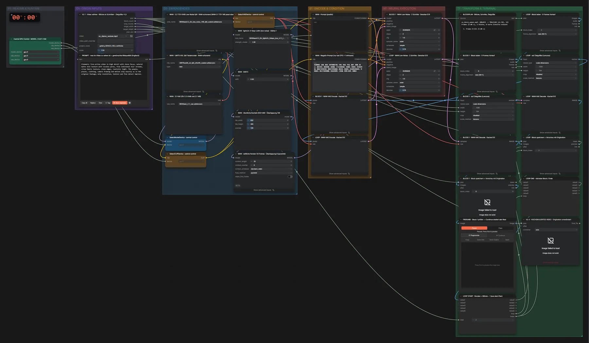

# WAN 2.2 T2V 14B Low-Noise (FP8) · Video-Upscale

**Workflow-Datei:** [`workflows/Video Upscaling/WAN22_T2V_14B_LowNoise_FP8-Video-Upscale.json`](../../../workflows/Video%20Upscaling/WAN22_T2V_14B_LowNoise_FP8-Video-Upscale.json)  
**Kategorie:** Video Upscaling · **Eingabe → Ausgabe:** Video → Video · **Quant:** FP8

Bis v1.3.0 hieß der Workflow `WAN22_14B_LowNoise-Video-Upscale.json`.

Kacheln in WAN-Nativgröße, 2 Schritte mit Denoise 0,15 – behält Mundformen und Details, auch für WAN-2.1-Videos.

Interaktiv mit Zoom, Vergleichen und Kopier-Buttons: <https://dawasteh.github.io/DaWastehs-ComfyUI-Bundle/#/w/wan22-t2v-14b-lownoise-fp8-video-upscale>

## Modelle

| Rolle | Datei | Quant | Größe |
|---|---|---|---:|
| Diffusionsmodell | `wan2.2_t2v_low_noise_14B_fp8_scaled.safetensors` | FP8 | 13,3 GiB |
| LoRA | `wan2.2_t2v_lightx2v_4steps_lora_v1.1_low_noise.safetensors` | FP32 | 1,1 GiB |
| Text-Encoder | `umt5_xxl_fp8_e4m3fn_scaled.safetensors` | FP8 | 6,3 GiB |
| VAE | `wan_2.1_vae.safetensors` | BF16 | 0,2 GiB |

## Workflow in ComfyUI

Screenshot nach dem Hauptbeispiel (Eingaben und Ergebnis im Workflow, Erklärungstafeln ausgeblendet):

[](workflow.webp)

## Beispiele

### 480×832 → ×1,5

| Einstellung | Wert |
|---|---|
| Dauer (Ausführung) | 4 min 50 s |
| VRAM R9700 (belegt / PyTorch-Spitze) | 28,3 GiB / 24,3 GiB |
| RAM (ComfyUI-Prozess) | 21,5 GiB |

Block 1 wird am Pause-Knoten geprüft, dann „Continue“ für den Rest (wie im Workflow vorgesehen).

Eingabe · ex_dance_woman.mp4: [input_ex_dance_woman.mp4](input_ex_dance_woman.mp4)  
Ausgabe · Final · VU 4 · HOCHSKALIERTES VIDEO · Originalton unverändert: [dance__n28.mp4](dance__n28.mp4)  
Ausgabe · Pass 1 · BLOCK 1 · Block speichern + Vorschau mit Originalton: [dance__n18.mp4](dance__n18.mp4)  

BLOCKPLAN · Blöcke, Schnitte, Zielgröße:

```text
ex_dance_woman.mp4: 480x832 -> 704x1248 (x1.50), 122 Frames (5.08 s), 1 Blöcke, 0 harte Schnitte erkannt

  1. Frames 0–121 (5.08 s)
```
