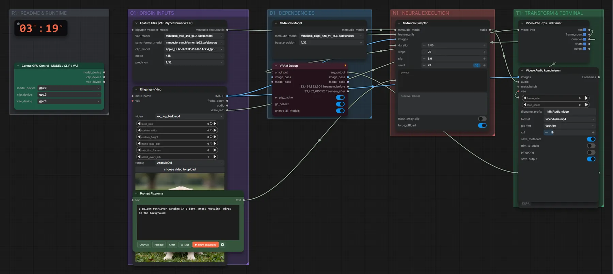

# MMAudio Large (FP32) · Video → passender Ton

**Workflow-Datei:** [`workflows/Video to Audio/MMAudio_Large_FP32-Video-to-Audio.json`](../../../workflows/Video%20to%20Audio/MMAudio_Large_FP32-Video-to-Audio.json)  
**Kategorie:** Video to Audio · **Eingabe → Ausgabe:** Video + Text → Audio + Video · **Quant:** FP32

Bis v1.3.0 hieß der Workflow `MMAudio_Video-to-Audio.json`.

Erzeugt Geräusche passend zum Bild (Schritte, Tiere, Wasser …) und legt sie unter das Video.

Interaktiv mit Zoom, Vergleichen und Kopier-Buttons: <https://dawasteh.github.io/DaWastehs-ComfyUI-Bundle/#/w/mmaudio-large-fp32-video-to-audio>

## Modelle

| Rolle | Datei | Quant | Größe |
|---|---|---|---:|
| Video→Audio | `mmaudio_large_44k_v2_fp32.safetensors` | FP32 | 3,8 GiB |
| Hilfsmodelle | `mmaudio_vae_44k_fp32.safetensors` | FP32 | 1,1 GiB |
| Hilfsmodelle | `mmaudio_synchformer_fp32.safetensors` | FP32 | 0,9 GiB |
| Hilfsmodelle | `apple_DFN5B-CLIP-ViT-H-14-384_fp32.safetensors` | FP32 | 3,7 GiB |

## Workflow in ComfyUI

Screenshot nach dem Hauptbeispiel (Eingaben und Ergebnis im Workflow, Erklärungstafeln ausgeblendet):

[](workflow.webp)

## Beispiele

### Hundegebell zum stummen Video

Prompt:

```text
a golden retriever barking in a park, grass rustling, birds in the background
```

| Einstellung | Wert |
|---|---|
| duration | Länge des Videos (5 s) |
| seed | 42 |
| Dauer (Ausführung) | 32 s |
| VRAM R9700 (belegt / PyTorch-Spitze) | 16,7 GiB / 11,7 GiB |
| RAM (ComfyUI-Prozess) | 12,2 GiB |

Eingabe · ex_dog_bark.mp4: [input_ex_dog_bark.mp4](input_ex_dog_bark.mp4)  
Ausgabe · Video+Audio kombinieren: [dog__n6.mp4](dog__n6.mp4)  
Ausgabe · Audio speichern: [dog__n5.mp3](dog__n5.mp3)
