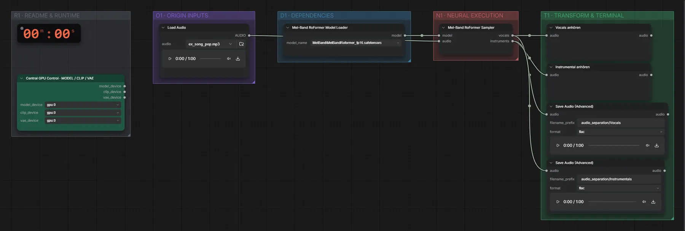

# MelBand-RoFormer (FP16) · Song → Gesang + Instrumental

**Workflow-Datei:** [`workflows/Vocal Separation/MelBandRoFormer_FP16-Song-to-Vocals+Instrumental.json`](../../../workflows/Vocal%20Separation/MelBandRoFormer_FP16-Song-to-Vocals%2BInstrumental.json)  
**Kategorie:** Vocal Separation · **Eingabe → Ausgabe:** Song → Audio · **Quant:** FP16

Bis v1.3.0 hieß der Workflow `Local_Vocal_Remover_MelBandRoFormer.json`.

Trennt Gesang und Begleitung eines Songs in zwei Spuren.

Interaktiv mit Zoom, Vergleichen und Kopier-Buttons: <https://dawasteh.github.io/DaWastehs-ComfyUI-Bundle/#/w/melbandroformer-fp16-song-to-vocals-instrumental>

## Modelle

| Rolle | Datei | Quant | Größe |
|---|---|---|---:|
| Quellentrennung | `MelBandRoformer_fp16.safetensors` | FP16 | 0,4 GiB |

## Workflow in ComfyUI

Screenshot nach dem Hauptbeispiel (Eingaben und Ergebnis im Workflow, Erklärungstafeln ausgeblendet):

## Beispiele

### Song → Gesang + Instrumental

| Einstellung | Wert |
|---|---|
| Dauer (Ausführung) | 25 s |
| VRAM R9700 (belegt / PyTorch-Spitze) | 14,1 GiB / 6,6 GiB |
| RAM (ComfyUI-Prozess) | 3,3 GiB |

Eingabe · ex_song_pop.mp3: [input_ex_song_pop.mp3](input_ex_song_pop.mp3)  
Ausgabe · Gesang: [pop__n10.mp3](pop__n10.mp3)  
Ausgabe · Instrumental: [pop__n11.mp3](pop__n11.mp3)
