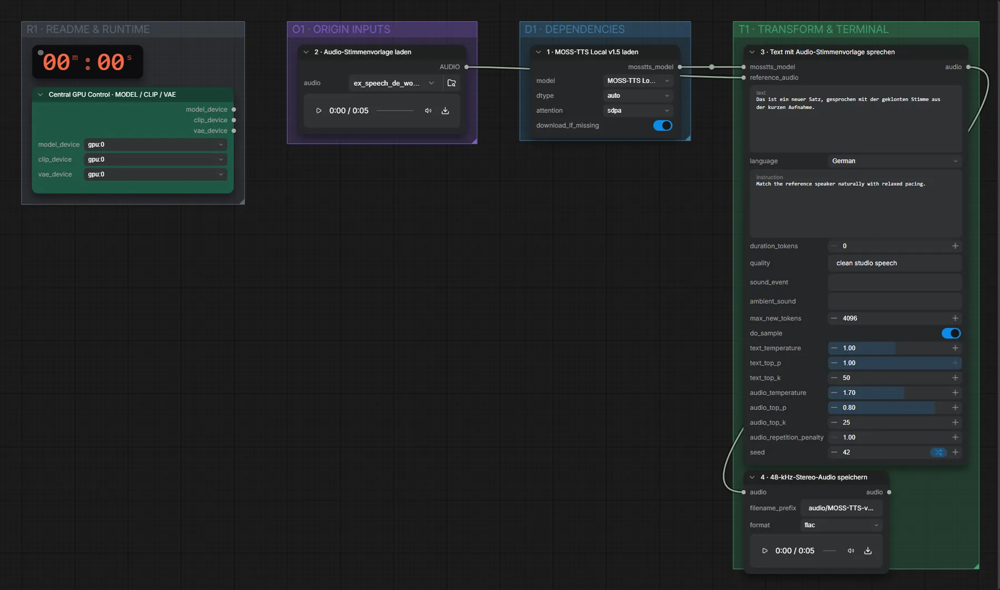

# MOSS-TTS v1.5 (BF16) · Text + Stimmprobe → Sprache

**Workflow-Datei:** [`workflows/Voice Design/MOSS_TTS_V1_5_BF16-Text+Voice-to-Speech.json`](../../../workflows/Voice%20Design/MOSS_TTS_V1_5_BF16-Text%2BVoice-to-Speech.json)  
**Kategorie:** Voice Design · **Eingabe → Ausgabe:** Text + Audio → Sprache · **Quant:** BF16

Bis v1.3.0 hieß der Workflow `MOSS-TTS_Local_v1.5-Text+Voice-Reference-to-Speech.json`.

Klont eine Stimme aus einer kurzen Aufnahme und spricht neuen Text (48 kHz Stereo).

Interaktiv mit Zoom, Vergleichen und Kopier-Buttons: <https://dawasteh.github.io/DaWastehs-ComfyUI-Bundle/#/w/moss-tts-v1-5-bf16-text-voice-to-speech>

## Workflow in ComfyUI

Screenshot nach dem Hauptbeispiel (Eingaben und Ergebnis im Workflow, Erklärungstafeln ausgeblendet):

## Beispiele

### Aufnahme → neue Sätze

| Einstellung | Wert |
|---|---|
| text | Das ist ein neuer Satz, gesprochen mit der geklonten Stimme aus der kurzen Aufnahme. |
| seed | 42 |
| Dauer (Ausführung) | 25 s |
| VRAM R9700 (belegt / PyTorch-Spitze) | 18,8 GiB / 16,8 GiB |
| RAM (ComfyUI-Prozess) | 17,3 GiB |

Eingabe · ex_speech_de_woman.mp3: [input_ex_speech_de_woman.mp3](input_ex_speech_de_woman.mp3)  
Ausgabe · 4 · 48-kHz-Stereo-Audio speichern: [clone-de.mp3](clone-de.mp3)
