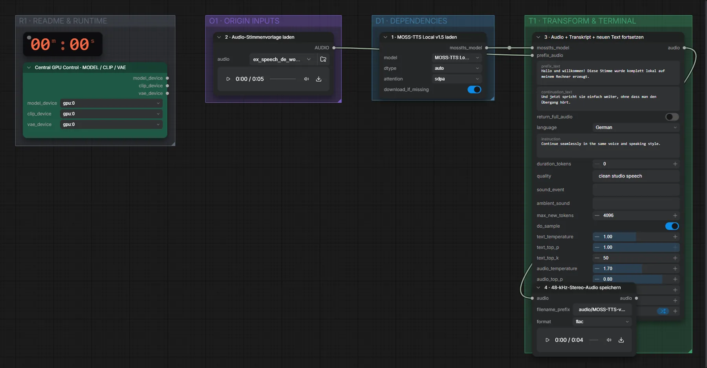

# MOSS-TTS v1.5 (BF16) · Aufnahme + Transkript → Fortsetzung

**Workflow-Datei:** [`workflows/Voice Design/MOSS_TTS_V1_5_BF16-Voice+Transcript-to-Speech-Continuation.json`](../../../workflows/Voice%20Design/MOSS_TTS_V1_5_BF16-Voice%2BTranscript-to-Speech-Continuation.json)  
**Kategorie:** Voice Design · **Eingabe → Ausgabe:** Audio + Text → Sprache · **Quant:** BF16

Bis v1.3.0 hieß der Workflow `MOSS-TTS_Local_v1.5-Audio+Transcript-to-Speech-Continuation.json`.

Setzt eine Sprachaufnahme nahtlos mit neuem Text in derselben Stimme fort.

Interaktiv mit Zoom, Vergleichen und Kopier-Buttons: <https://dawasteh.github.io/DaWastehs-ComfyUI-Bundle/#/w/moss-tts-v1-5-bf16-voice-transcript-to-speech-continuation>

## Workflow in ComfyUI

Screenshot nach dem Hauptbeispiel (Eingaben und Ergebnis im Workflow, Erklärungstafeln ausgeblendet):

## Beispiele

### Aufnahme + Transkript → Fortsetzung

| Einstellung | Wert |
|---|---|
| reference_text | Hallo und willkommen! Diese Stimme wurde komplett lokal auf meinem Rechner erzeugt. |
| text | Und jetzt spricht sie einfach weiter, ohne dass man den Übergang hört. |
| seed | 42 |
| Dauer (Ausführung) | 15 s |
| VRAM R9700 (belegt / PyTorch-Spitze) | 18,2 GiB / 16,8 GiB |
| RAM (ComfyUI-Prozess) | 17,0 GiB |

Eingabe · ex_speech_de_woman.mp3: [input_ex_speech_de_woman.mp3](input_ex_speech_de_woman.mp3)  
Ausgabe · 4 · 48-kHz-Stereo-Audio speichern: [continue-de.mp3](continue-de.mp3)
