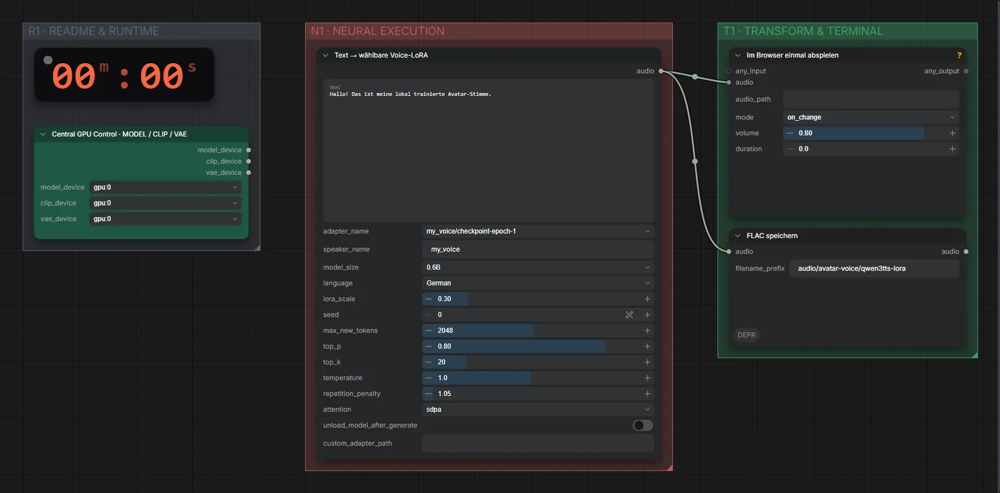

# Qwen3-TTS 0.6B + Voice-LoRA · Text → eigene Stimme (live)

**Workflow-Datei:** [`workflows/Voice Design/Qwen3_TTS_0_6B_Base+LoRA-Text-to-Speech-Live.json`](../../../workflows/Voice%20Design/Qwen3_TTS_0_6B_Base%2BLoRA-Text-to-Speech-Live.json)  
**Kategorie:** Voice Design · **Eingabe → Ausgabe:** Text → Sprache

Bis v1.3.0 hieß der Workflow `Qwen3-TTS_LoRA-Low-Latency-Live-Voice.json`.

Schnelle Sprachausgabe mit einer selbst trainierten Stimmen-LoRA, etwa für den Live-Avatar.

Interaktiv mit Zoom, Vergleichen und Kopier-Buttons: <https://dawasteh.github.io/DaWastehs-ComfyUI-Bundle/#/w/qwen3-tts-0-6b-base-lora-text-to-speech-live>

> Kein Beispiel: nutzt eine private, selbst trainierte Stimme (siehe LoRA-Training).

## Workflow in ComfyUI

Screenshot nach dem Hauptbeispiel (Eingaben und Ergebnis im Workflow, Erklärungstafeln ausgeblendet):

