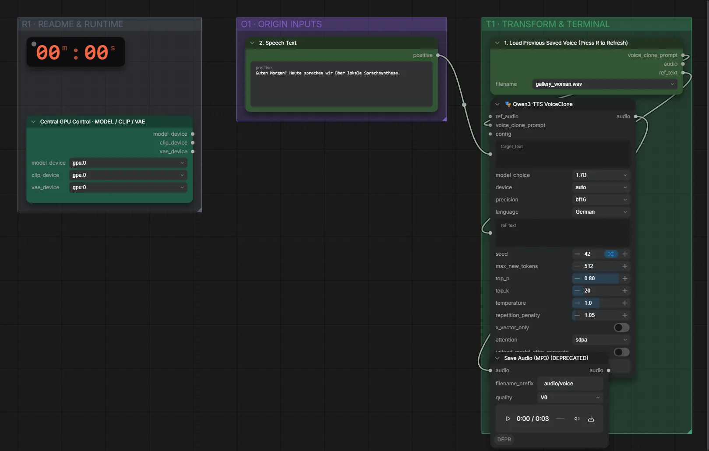

# Qwen3-TTS 1.7B Base (BF16) · gespeicherte Stimme → Sprache

**Workflow-Datei:** [`workflows/Voice Design/Qwen3_TTS_1_7B_Base_BF16-Saved-Voice+Text-to-Speech.json`](../../../workflows/Voice%20Design/Qwen3_TTS_1_7B_Base_BF16-Saved-Voice%2BText-to-Speech.json)  
**Kategorie:** Voice Design · **Eingabe → Ausgabe:** Stimme + Text → Sprache · **Quant:** BF16

Bis v1.3.0 hieß der Workflow `QwenTTS_VoiceClone-Load-Saved-Voice.json`.

Eine vorher gespeicherte, geklonte Stimme laden und neuen Text sprechen.

Interaktiv mit Zoom, Vergleichen und Kopier-Buttons: <https://dawasteh.github.io/DaWastehs-ComfyUI-Bundle/#/w/qwen3-tts-1-7b-base-bf16-saved-voice-text-to-speech>

## Workflow in ComfyUI

Screenshot nach dem Hauptbeispiel (Eingaben und Ergebnis im Workflow, Erklärungstafeln ausgeblendet):

## Beispiele

### Gespeicherte Stimme verwenden

| Einstellung | Wert |
|---|---|
| voice | gallery_woman (aus „Stimme klonen und speichern“) |
| text | Guten Morgen! Heute sprechen wir über lokale Sprachsynthese. |
| seed | 42 |
| Dauer (Ausführung) | 8 s |
| VRAM R9700 (belegt / PyTorch-Spitze) | 9,6 GiB / 8,4 GiB |
| RAM (ComfyUI-Prozess) | 6,2 GiB |

Ausgabe · Ausgabe: [load-woman.mp3](load-woman.mp3)
