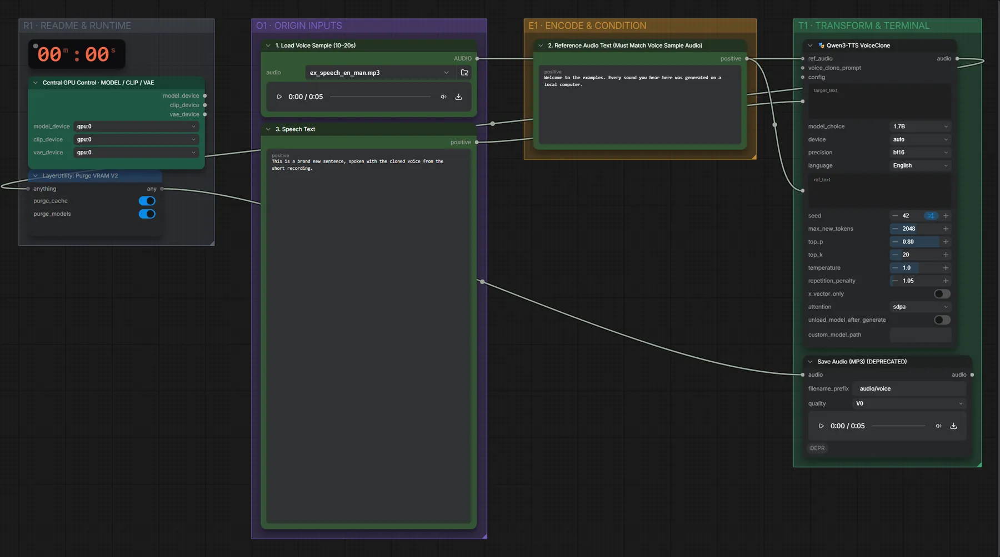

# Qwen3-TTS 1.7B Base (BF16) · Stimmprobe + Text → Sprache

**Workflow-Datei:** [`workflows/Voice Design/Qwen3_TTS_1_7B_Base_BF16-Voice+Text-to-Speech.json`](../../../workflows/Voice%20Design/Qwen3_TTS_1_7B_Base_BF16-Voice%2BText-to-Speech.json)  
**Kategorie:** Voice Design · **Eingabe → Ausgabe:** Audio + Text → Sprache · **Quant:** BF16

Bis v1.3.0 hieß der Workflow `QwenTTS_VoiceClone-Voice-Generation.json`.

Direktes Klonen ohne Speichern: Aufnahme, Transkript und neuer Text.

Interaktiv mit Zoom, Vergleichen und Kopier-Buttons: <https://dawasteh.github.io/DaWastehs-ComfyUI-Bundle/#/w/qwen3-tts-1-7b-base-bf16-voice-text-to-speech>

## Workflow in ComfyUI

Screenshot nach dem Hauptbeispiel (Eingaben und Ergebnis im Workflow, Erklärungstafeln ausgeblendet):

## Beispiele

### Aufnahme + Transkript → neue Sätze

| Einstellung | Wert |
|---|---|
| reference_text | Welcome to the examples. Every sound you hear here was generated on a local computer. |
| text | This is a brand new sentence, spoken with the cloned voice from the short recording. |
| seed | 42 |
| Dauer (Ausführung) | 13 s |
| VRAM R9700 (belegt / PyTorch-Spitze) | 9,9 GiB / 5,4 GiB |
| RAM (ComfyUI-Prozess) | 5,4 GiB |

Eingabe · ex_speech_en_man.mp3: [input_ex_speech_en_man.mp3](input_ex_speech_en_man.mp3)  
Ausgabe · Ausgabe: [clone-en.mp3](clone-en.mp3)
