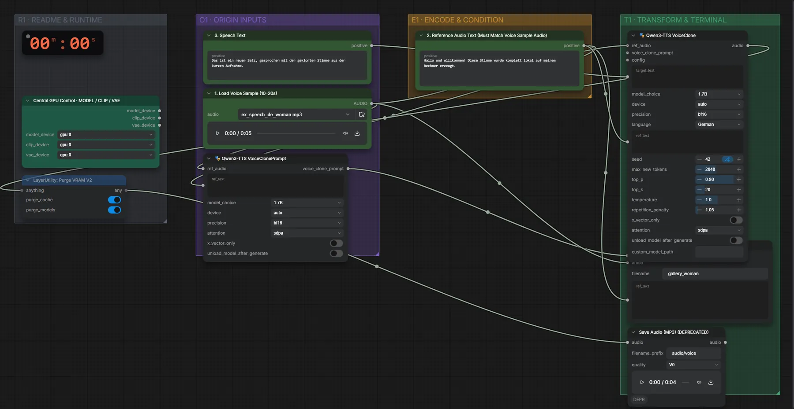

# Qwen3-TTS 1.7B Base (BF16) · Stimme klonen und speichern

**Workflow-Datei:** [`workflows/Voice Design/Qwen3_TTS_1_7B_Base_BF16-Voice-to-Saved-Voice.json`](../../../workflows/Voice%20Design/Qwen3_TTS_1_7B_Base_BF16-Voice-to-Saved-Voice.json)  
**Kategorie:** Voice Design · **Eingabe → Ausgabe:** Audio + Text → Stimme + Sprache · **Quant:** BF16

Bis v1.3.0 hieß der Workflow `QwenTTS_VoiceClone-Save-Voice.json`.

Aufnahme (10–20 s) + exaktes Transkript: Stimme klonen, als Datei speichern und gleich einen Satz sprechen.

Interaktiv mit Zoom, Vergleichen und Kopier-Buttons: <https://dawasteh.github.io/DaWastehs-ComfyUI-Bundle/#/w/qwen3-tts-1-7b-base-bf16-voice-to-saved-voice>

## Workflow in ComfyUI

Screenshot nach dem Hauptbeispiel (Eingaben und Ergebnis im Workflow, Erklärungstafeln ausgeblendet):

## Beispiele

### Stimme klonen und speichern

| Einstellung | Wert |
|---|---|
| reference_text | Hallo und willkommen! Diese Stimme wurde komplett lokal auf meinem Rechner erzeugt. |
| text | Das ist ein neuer Satz, gesprochen mit der geklonten Stimme aus der kurzen Aufnahme. |
| saved_as | gallery_woman |
| seed | 42 |
| Dauer (Ausführung) | 14 s |
| VRAM R9700 (belegt / PyTorch-Spitze) | 5,7 GiB / 4,6 GiB |
| RAM (ComfyUI-Prozess) | 5,9 GiB |

Eingabe · ex_speech_de_woman.mp3: [input_ex_speech_de_woman.mp3](input_ex_speech_de_woman.mp3)  
Ausgabe · Ausgabe: [save-woman.mp3](save-woman.mp3)
