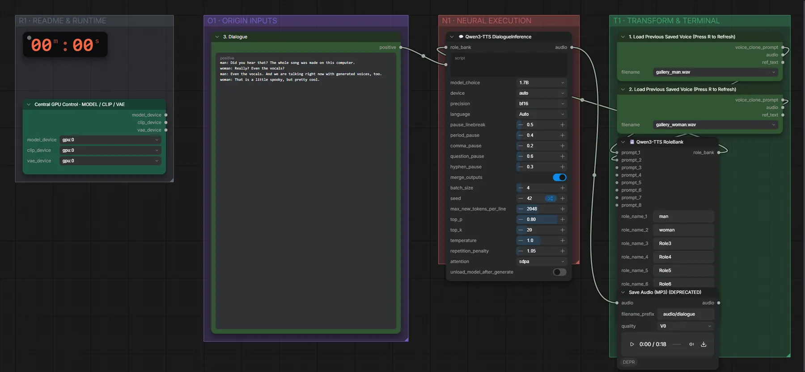

# Qwen3-TTS 1.7B Base (BF16) · Dialog mit gespeicherten Stimmen

**Workflow-Datei:** [`workflows/Voice Design/Qwen3_TTS_1_7B_Base_BF16-Voices+Script-to-Dialogue.json`](../../../workflows/Voice%20Design/Qwen3_TTS_1_7B_Base_BF16-Voices%2BScript-to-Dialogue.json)  
**Kategorie:** Voice Design · **Eingabe → Ausgabe:** Stimme + Text → Sprache · **Quant:** BF16

Bis v1.3.0 hieß der Workflow `QwenTTS_VoiceClone-Multi-Voice-Dialogue.json`.

Ein Skript mit Rollen (man: …, woman: …) wird mit zwei gespeicherten Stimmen gesprochen.

Interaktiv mit Zoom, Vergleichen und Kopier-Buttons: <https://dawasteh.github.io/DaWastehs-ComfyUI-Bundle/#/w/qwen3-tts-1-7b-base-bf16-voices-script-to-dialogue>

## Workflow in ComfyUI

Screenshot nach dem Hauptbeispiel (Eingaben und Ergebnis im Workflow, Erklärungstafeln ausgeblendet):

## Beispiele

### Zwei gespeicherte Stimmen → Dialog

| Einstellung | Wert |
|---|---|
| script | man: Did you hear that? The whole song was made on this computer.
woman: Really? Even the vocals?
man: Even the vocals. And we are talking right now with generated voices, too.
woman: That is a little spooky, but pretty cool. |
| seed | 42 |
| Dauer (Ausführung) | 11 s |
| VRAM R9700 (belegt / PyTorch-Spitze) | 11,1 GiB / 8,8 GiB |
| RAM (ComfyUI-Prozess) | 6,2 GiB |

Ausgabe · Ausgabe: [dialogue.mp3](dialogue.mp3)
