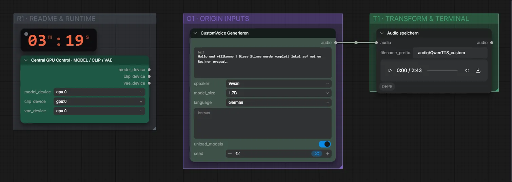

# Qwen3-TTS 1.7B CustomVoice (BF16) · Text → Sprache mit fertiger Stimme

**Workflow-Datei:** [`workflows/Voice Design/Qwen3_TTS_1_7B_CustomVoice_BF16-Text-to-Speech.json`](../../../workflows/Voice%20Design/Qwen3_TTS_1_7B_CustomVoice_BF16-Text-to-Speech.json)  
**Kategorie:** Voice Design · **Eingabe → Ausgabe:** Text → Sprache · **Quant:** BF16

Bis v1.3.0 hieß der Workflow `QwenTTS_CustomVoice-Text-to-Voice.json`.

Neun eingebaute Stimmen (z. B. Vivian, Ryan), zehn Sprachen, optional mit Sprechanweisung.

Interaktiv mit Zoom, Vergleichen und Kopier-Buttons: <https://dawasteh.github.io/DaWastehs-ComfyUI-Bundle/#/w/qwen3-tts-1-7b-customvoice-bf16-text-to-speech>

## Workflow in ComfyUI

Screenshot nach dem Hauptbeispiel (Eingaben und Ergebnis im Workflow, Erklärungstafeln ausgeblendet):

## Beispiele

### Vorgefertigte Stimme „Vivian“

| Einstellung | Wert |
|---|---|
| text | Hallo und willkommen! Diese Stimme wurde komplett lokal auf meinem Rechner erzeugt. |
| speaker | Vivian |
| language | German |
| seed | 42 |
| Dauer (Ausführung) | 3 min 7 s |
| VRAM R9700 (belegt / PyTorch-Spitze) | 8,1 GiB / 5,7 GiB |
| RAM (ComfyUI-Prozess) | 4,6 GiB |

Ausgabe · Audio speichern: [vivian.mp3](vivian.mp3)  

### Vorgefertigte Stimme „Ryan“

| Einstellung | Wert |
|---|---|
| text | Welcome to the examples. Every sound you hear here was generated on a local computer. |
| speaker | Ryan |
| language | English |
| seed | 42 |
| Dauer (Ausführung) | 11 s |
| VRAM R9700 (belegt / PyTorch-Spitze) | 5,3 GiB / 4,4 GiB |
| RAM (ComfyUI-Prozess) | 6,1 GiB |

Ausgabe · Audio speichern: [ryan.mp3](ryan.mp3)
