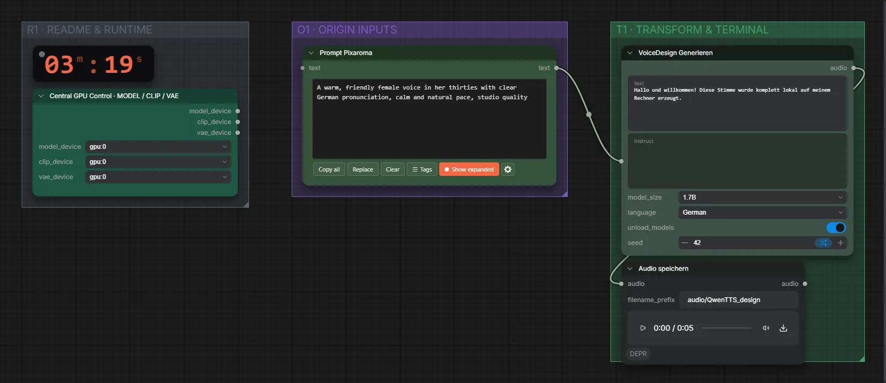

# Qwen3-TTS 1.7B VoiceDesign (BF16) · Stimmbeschreibung + Text → Sprache

**Workflow-Datei:** [`workflows/Voice Design/Qwen3_TTS_1_7B_VoiceDesign_BF16-Description+Text-to-Speech.json`](../../../workflows/Voice%20Design/Qwen3_TTS_1_7B_VoiceDesign_BF16-Description%2BText-to-Speech.json)  
**Kategorie:** Voice Design · **Eingabe → Ausgabe:** Text → Sprache · **Quant:** BF16

Bis v1.3.0 hieß der Workflow `QwenTTS_VoiceDesign-Voice-Generation.json`.

Eine neue Stimme nur aus einer Beschreibung erzeugen – ohne Aufnahme.

Interaktiv mit Zoom, Vergleichen und Kopier-Buttons: <https://dawasteh.github.io/DaWastehs-ComfyUI-Bundle/#/w/qwen3-tts-1-7b-voicedesign-bf16-description-text-to-speech>

## Workflow in ComfyUI

Screenshot nach dem Hauptbeispiel (Eingaben und Ergebnis im Workflow, Erklärungstafeln ausgeblendet):

[](workflow.webp)

## Beispiele

### Stimmbeschreibung + Text → Sprache (Deutsch)

Prompt:

```text
A warm, friendly female voice in her thirties with clear German pronunciation, calm and natural pace, studio quality
```

| Einstellung | Wert |
|---|---|
| text | Hallo und willkommen! Diese Stimme wurde komplett lokal auf meinem Rechner erzeugt. |
| language | German |
| seed | 42 |
| Dauer (Ausführung) | 10 s |
| VRAM R9700 (belegt / PyTorch-Spitze) | 5,4 GiB / 4,4 GiB |
| RAM (ComfyUI-Prozess) | 4,7 GiB |

Ausgabe · Audio speichern: [de-woman.mp3](de-woman.mp3)  

### Stimmbeschreibung + Text → Sprache (Englisch)

Prompt:

```text
A deep, calm male voice in his forties with a slight British accent, speaking slowly and warmly
```

| Einstellung | Wert |
|---|---|
| text | Welcome to the examples. Every sound you hear here was generated on a local computer. |
| language | English |
| seed | 43 |
| Dauer (Ausführung) | 10 s |
| VRAM R9700 (belegt / PyTorch-Spitze) | 5,4 GiB / 4,4 GiB |
| RAM (ComfyUI-Prozess) | 4,6 GiB |

Ausgabe · Audio speichern: [en-man.mp3](en-man.mp3)
