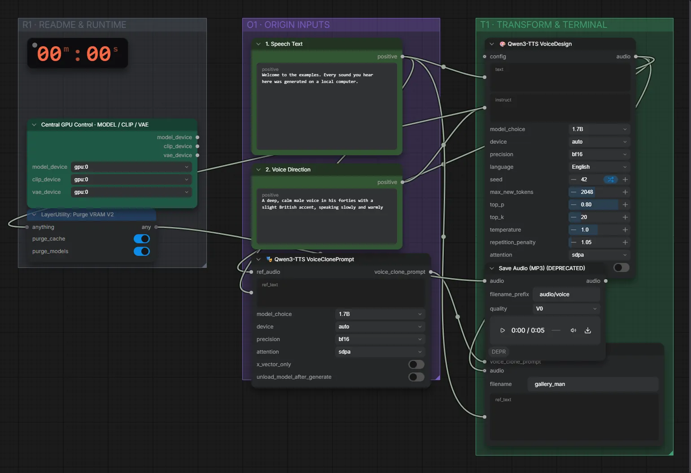

# Qwen3-TTS 1.7B VoiceDesign (BF16) · Stimme entwerfen und speichern

**Workflow-Datei:** [`workflows/Voice Design/Qwen3_TTS_1_7B_VoiceDesign_BF16-Description-to-Saved-Voice.json`](../../../workflows/Voice%20Design/Qwen3_TTS_1_7B_VoiceDesign_BF16-Description-to-Saved-Voice.json)  
**Kategorie:** Voice Design · **Eingabe → Ausgabe:** Text → Stimme + Sprache · **Quant:** BF16

Bis v1.3.0 hieß der Workflow `QwenTTS_VoiceDesign-Save-Voice.json`.

Stimme per Beschreibung (Alter, Klang, Tempo, Akzent) entwerfen und für spätere Workflows speichern.

Interaktiv mit Zoom, Vergleichen und Kopier-Buttons: <https://dawasteh.github.io/DaWastehs-ComfyUI-Bundle/#/w/qwen3-tts-1-7b-voicedesign-bf16-description-to-saved-voice>

## Workflow in ComfyUI

Screenshot nach dem Hauptbeispiel (Eingaben und Ergebnis im Workflow, Erklärungstafeln ausgeblendet):

[](workflow.webp)

## Beispiele

### Stimme entwerfen und speichern

Prompt:

```text
A deep, calm male voice in his forties with a slight British accent, speaking slowly and warmly
```

| Einstellung | Wert |
|---|---|
| text | Welcome to the examples. Every sound you hear here was generated on a local computer. |
| saved_as | gallery_man |
| seed | 42 |
| Dauer (Ausführung) | 15 s |
| VRAM R9700 (belegt / PyTorch-Spitze) | 9,2 GiB / 8,2 GiB |
| RAM (ComfyUI-Prozess) | 6,0 GiB |

Ausgabe · Ausgabe: [save-man.mp3](save-man.mp3)
