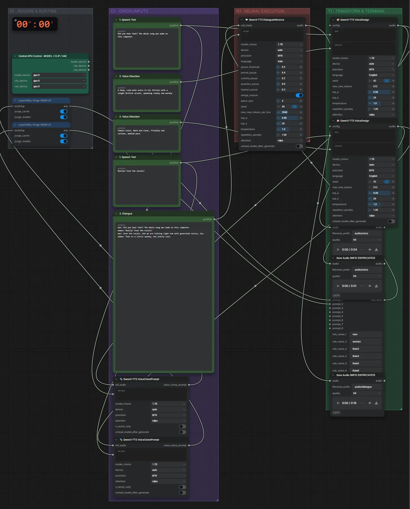

# Qwen3-TTS 1.7B VoiceDesign (BF16) · zwei beschriebene Stimmen → Dialog

**Workflow-Datei:** [`workflows/Voice Design/Qwen3_TTS_1_7B_VoiceDesign_BF16-Descriptions+Script-to-Dialogue.json`](../../../workflows/Voice%20Design/Qwen3_TTS_1_7B_VoiceDesign_BF16-Descriptions%2BScript-to-Dialogue.json)  
**Kategorie:** Voice Design · **Eingabe → Ausgabe:** Text → Sprache · **Quant:** BF16

Bis v1.3.0 hieß der Workflow `QwenTTS_VoiceDesign-Dialogue.json`.

Zwei Stimmen per Beschreibung entwerfen und ein Dialog-Skript sprechen lassen.

Interaktiv mit Zoom, Vergleichen und Kopier-Buttons: <https://dawasteh.github.io/DaWastehs-ComfyUI-Bundle/#/w/qwen3-tts-1-7b-voicedesign-bf16-descriptions-script-to-dialogue>

## Workflow in ComfyUI

Screenshot nach dem Hauptbeispiel (Eingaben und Ergebnis im Workflow, Erklärungstafeln ausgeblendet):

## Beispiele

### Zwei Stimmbeschreibungen → Dialog

| Einstellung | Wert |
|---|---|
| script | man: Did you hear that? The whole song was made on this computer.
woman: Really? Even the vocals?
man: Even the vocals. And we are talking right now with generated voices, too.
woman: That is a little spooky, but pretty cool. |
| seed | 42 |
| Dauer (Ausführung) | 30 s |
| VRAM R9700 (belegt / PyTorch-Spitze) | 10,8 GiB / 8,9 GiB |
| RAM (ComfyUI-Prozess) | 5,5 GiB |

Ausgabe · Audio 1: [dialogue__n16.mp3](dialogue__n16.mp3)  
Ausgabe · Audio 2: [dialogue__n8.mp3](dialogue__n8.mp3)  
Ausgabe · Audio 3: [dialogue__n24.mp3](dialogue__n24.mp3)
