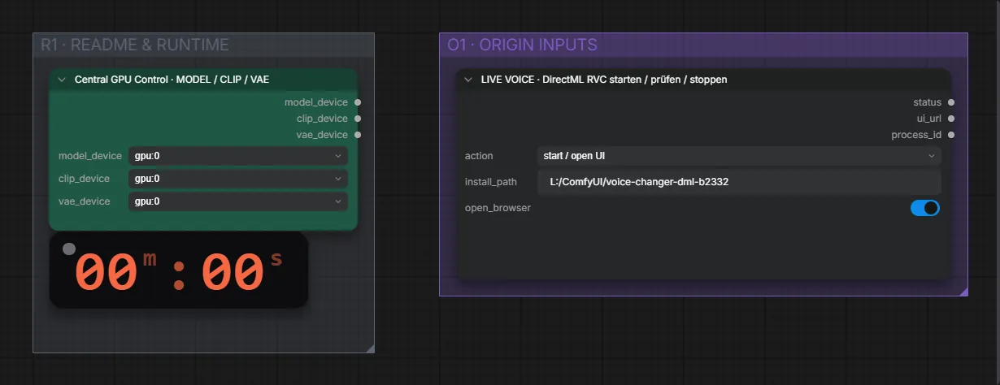

# RVC (DirectML) · Mikrofon → andere Stimme (live)

**Workflow-Datei:** [`workflows/Voice Design/RVC_DirectML-Microphone-to-Voice-Swap-Live.json`](../../../workflows/Voice%20Design/RVC_DirectML-Microphone-to-Voice-Swap-Live.json)  
**Kategorie:** Voice Design · **Eingabe → Ausgabe:** Mikrofon → Sprache

Bis v1.3.0 hieß der Workflow `RVC_DirectML-Live-Microphone-Voice-Swap.json`.

Startet und prüft den DirectML-RVC-Stimmwandler für Live-Mikrofon und OBS.

Interaktiv mit Zoom, Vergleichen und Kopier-Buttons: <https://dawasteh.github.io/DaWastehs-ComfyUI-Bundle/#/w/rvc-directml-microphone-to-voice-swap-live>

> Kein Beispiel: Echtzeit-Workflow (Mikrofon-Eingang), der einen externen Dienst startet.

## Workflow in ComfyUI

Screenshot nach dem Hauptbeispiel (Eingaben und Ergebnis im Workflow, Erklärungstafeln ausgeblendet):

